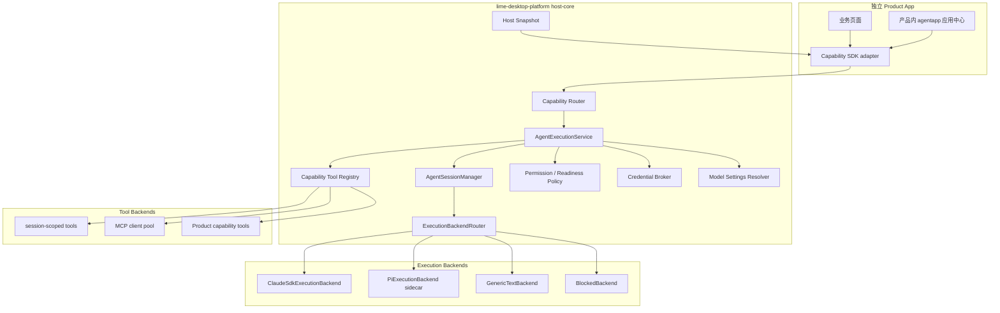
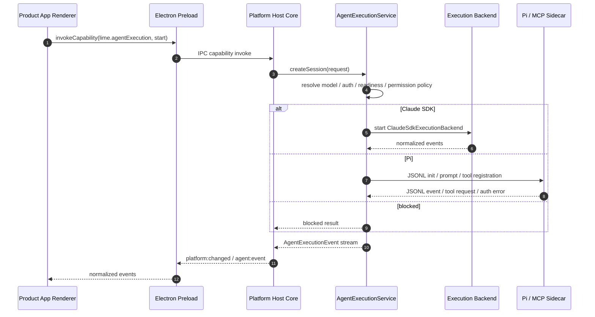
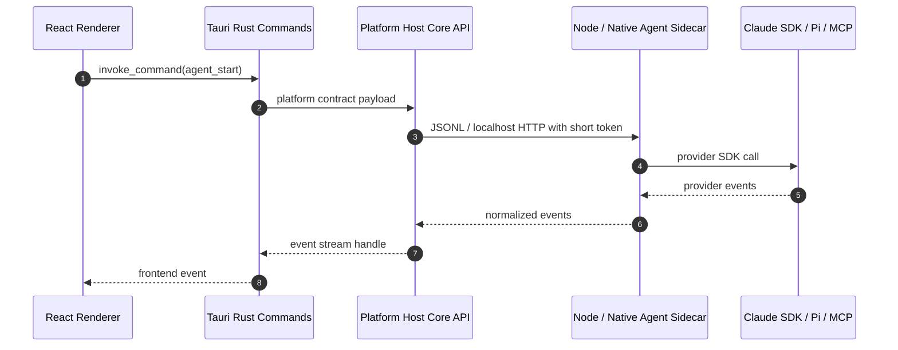
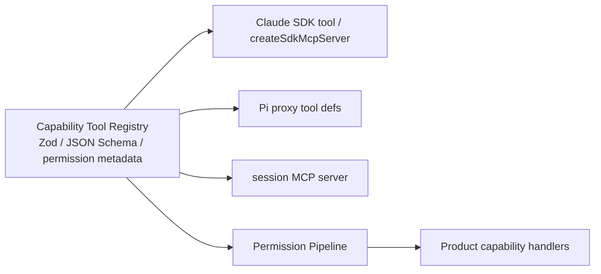

# Agent Runtime 策略

## 1. 结论

`/Users/coso/Documents/dev/js/craft-agents-oss` 的 Claude SDK 和 Pi 实践值得参考，但不能照搬到 `lime-desktop-platform`。它是面向 Craft 文档和编码会话的完整产品实现，里面有大量产品内 source、automation、workspace、feedback、文档工具和会话 UI 逻辑。`lime-desktop-platform` 需要吸收的是运行时工程模式，不是业务形态。

后续事实源关系必须保持不变：

- `agentapp` 是 Agent App / 应用中心标准事实源。
- `lime-desktop-platform` 是桌面宿主、公共能力和 Agent Execution Runtime 的实现方。
- `content-studio`、`zhongcao`、OEM App 是独立 Product App，只消费平台能力，不直接依赖 Claude SDK、Pi SDK 或平台内部 session manager。
- Claude SDK、Pi、MCP session tools 都只能作为 `host-core` 后面的可插拔 execution backend / tool backend。
- runtime-backed reference shell 只服务 conformance / smoke，不代表 Product App 生产运行模型。

一句话：平台要抽象的是 `AgentExecutionService`，不是把某个 SDK 直接暴露给业务 App。

## 2. craft-agents-oss 可吸收模式

| 来源 | 做法 | 对平台的价值 | 平台采纳方式 |
| --- | --- | --- | --- |
| `packages/shared/src/agent/backend/types.ts` | 统一 `AgentBackend` 接口，所有 backend 输出同一种事件流。 | Product App 不关心 provider 差异。 | 建立平台级 `AgentExecutionBackend`，统一 `start / send / abort / event / dispose`。 |
| `packages/shared/src/agent/backend/factory.ts` | LLM connection 先解析 provider、auth、model，再选择 backend。 | 模型设置和执行后端解耦。 | `lime.modelSettings` 仍是模型事实源，execution router 只消费解析结果。 |
| `packages/shared/src/agent/claude-agent.ts` | Claude SDK `query()`、MCP server、PreToolUse hook、resume/fork、permission hook。 | Claude Code / Claude Agent 能力可作为高阶 agent backend。 | 做成 `ClaudeSdkExecutionBackend`，事件归一化后再给平台 session。 |
| `packages/shared/src/agent/pi-agent.ts` | Pi 通过子进程 JSONL 通信，主进程只管协议、事件队列、权限和 proxy tool。 | 隔离 ESM、重依赖、运行时崩溃和 bundling 风险。 | Pi 默认作为 sidecar backend，不进入 renderer，也不污染 Product App。 |
| `packages/pi-agent-server/src/index.ts` | 子进程持有 Pi SDK、auth storage、model registry、tool allowlist、token update。 | 多 provider / custom endpoint 可以在独立进程内演进。 | 平台定义 JSONL/HTTP sidecar 协议，Electron 和 Tauri 都可复用。 |
| `packages/session-tools-core/src/tool-defs.ts` | Zod schema 是 session tool 单一事实源，再转 Claude tool / MCP JSON Schema / Pi proxy tool。 | 同一工具集可供不同 backend 使用。 | 平台建立 Capability Tool Registry，工具 schema 不跟某个 backend 绑定。 |
| `packages/session-mcp-server/src/index.ts` | session-scoped MCP server 通过 stdio 暴露工具，用 callback 回到主进程。 | 后端可用标准 MCP 接入 session 工具。 | 产品工具、平台设置、OAuth 触发、诊断工具统一走 session-scoped tool bridge。 |
| `packages/shared/src/auth/state.ts` | token refresh mutex，保守清理失效凭据。 | 防止并发刷新和半成功认证状态。 | OAuth / 模型凭据仍由平台 credential boundary 管理，backend 只拿短期投影。 |
| `packages/shared/src/config/llm-connections.ts` | providerType、authType、custom endpoint、model list、image capability 分离。 | 支持 OpenAI-compatible、Anthropic-compatible、本地模型、OAuth 等差异。 | 平台模型设置需要引入 provider / auth / protocol / capability 四层模型。 |
| `packages/server-core/src/sessions/runtime-config.ts` | runtime config signature 决定热更新还是重启 backend。 | 切模型、切 endpoint、切凭据时避免 stale subprocess。 | 平台 session runtime 要有 `runtimeSignature`，漂移时安全重建。 |

## 3. 目标架构



设计重点：

- Product App 只看到 `Capability SDK`、`Host Snapshot` 和事件，不看到 Claude SDK / Pi SDK。
- `AgentExecutionService` 是平台 current surface；Claude SDK / Pi 是 adapter。
- 工具 schema、权限策略、模型设置、OAuth、billing 都在平台侧裁决。
- 事件流必须归一化，业务 UI 不根据 provider 写分支。
- Tauri 不需要复制业务协议；Rust adapter 只替换宿主通信和 sidecar 管理。

## 4. Provider 选择策略

| backend | 适用场景 | 不适用场景 | 初期状态 |
| --- | --- | --- | --- |
| `ClaudeSdkExecutionBackend` | Claude Code / Claude Agent 风格任务、工具调用、会话恢复、MCP 工具、Claude 原生能力。 | 非 Claude provider 被硬塞进 Claude SDK；纯文本生成；图片 / 视频生成。 | P2 接入。 |
| `PiExecutionBackend` | 多 provider agent loop、OpenAI / Copilot / Bedrock / custom endpoint、需要统一工具调用和模型路由。 | 简单 prompt completion；对运行隔离要求极低的本地小任务。 | P3 接入，默认 sidecar。 |
| `GenericTextBackend` | 简单文本生成、标题、摘要、低风险 structured output。 | 复杂会话、工具权限、文件操作、MCP、多轮恢复。 | P1 可先做 blocked / mock / generic。 |
| `BlockedBackend` | 缺 OAuth、缺模型、缺 entitlement、policy 拒绝、backend 未安装。 | 不应伪装成功。 | P0 即需要。 |

`content-studio` 当前已有自己的文本、图片、视频生成边界；迁移到平台时不能把图片 / 视频塞进 Claude SDK 或 Pi。平台需要按 capability 分路：agent execution 是 agent loop，media generation 是另一组 provider capability。

## 5. 进程边界

### 5.1 Electron



Electron 主进程可以管理 Node sidecar。renderer 不能直接 spawn、不能读 token、不能 import SDK。

### 5.2 Tauri



Tauri 的关键不是把 Pi 或 Claude SDK 改写成 Rust，而是把平台公开契约稳定成 JSON schema，并让 Rust adapter 只承担进程管理、命令桥和安全边界。

## 6. Tool / MCP 策略

平台需要一个 backend 无关的工具事实源：



工具分层：

- 平台工具：模型设置、OAuth 触发、billing 状态、诊断、更新、应用中心。
- Product 工具：`zhongcao` 的种草内容生成、GEO 检查、发布 readiness；`content-studio` 的 SOP、素材、审核、媒体生成。
- Session 工具：计划提交、配置验证、只读上下文读取、受限脚本或 transform。
- 外部 MCP 工具：GitHub、Linear、Slack、Google 等 source 工具。

默认原则：

- 工具 schema 是 current；backend-specific tool wrapper 是 adapter。
- 所有 mutation 走权限和 readiness。
- OAuth / credential prompt 只触发平台 UI，不把 token 给 Product App。
- `safe / ask / allow-all` 这类权限模式可以借鉴，但命名和默认值要按 Lime 产品场景重新定。

## 7. 会话与事件契约

规划中的平台契约应收敛为：

```ts
export interface AgentExecutionRequest {
  appId: string;
  entryKey: string;
  agentAppId?: string;
  taskId?: string;
  prompt: string;
  attachments?: Array<{ kind: 'text' | 'image' | 'file'; ref: string; mimeType?: string }>;
  modelPolicy?: {
    preferredModelId?: string;
    capability: 'text' | 'agent' | 'vision';
  };
  toolPolicy?: {
    allowedToolIds?: string[];
    permissionMode?: 'safe' | 'ask' | 'allow-all';
  };
}

export interface AgentExecutionEvent {
  sessionId: string;
  sequence: number;
  type:
    | 'started'
    | 'assistant-delta'
    | 'tool-call'
    | 'tool-result'
    | 'permission-request'
    | 'needs-setup'
    | 'blocked'
    | 'completed'
    | 'failed';
  payload: unknown;
  evidence?: Array<{ label: string; ref: string }>;
}
```

这些类型进入 contracts 前必须先和 `agentapp` 标准对齐。Product App 不能自己扩展一套私有 agent event 协议；如果确实需要领域事件，应包在 `payload` 内，由对应 agentapp package 声明。

## 8. Auth / 模型设置边界

`craft-agents-oss` 的可借鉴点是 named LLM connection，而不是它的具体配置文件形态。平台应收敛为：

- `ModelProviderConfig` 表示 provider、protocol、capability、model list。
- `ModelConnection` 表示 authType、baseUrl、custom endpoint、default model、capability override。
- `CredentialBroker` 持有 token / key / OAuth refresh，不暴露给 renderer 和 Product App。
- `runtimeSignature` 判断 session 能否热更新；provider、authType、baseUrl、custom endpoint、model capability 变化时优先重建 backend。
- OAuth 刷新必须有 mutex，失败时返回 `needs-setup` 或 `blocked`，不能半成功。

## 9. 落地切片

### P0: 文档与契约

- 固化 `AgentExecutionService` 边界。
- 明确 Claude SDK / Pi 是 adapter，不是公开协议。
- 在 docs 和 contracts README 标记 current / proposed / compat / dead。

### P1: 最小 AgentExecutionService

- `lime.agentExecution` capability 先返回 `blocked` / `needs-setup` / normalized event。
- 接入模型设置、OAuth、billing readiness。
- Product App 只通过 Capability SDK 调用。

当前代码状态：`src/main/services/agentExecution/` 已落最小 backend router、backend descriptor、Claude / Pi / Generic 的 not-installed adapter、sidecar protocol skeleton、Tool Registry skeleton 和 `BlockedBackend`，用于证明平台 contract、capability invoke、readiness、工具注册入口、sidecar 边界和事件归一化路径可用。它不会调用 Claude SDK 或 Pi SDK，也不会伪装成功。

### P2: Claude SDK backend

- 封装 `ClaudeSdkExecutionBackend`。
- 归一化 Claude SDK message 到平台 `AgentExecutionEvent`。
- 接入 PreToolUse 权限管线和 session-scoped tool registry。
- 支持 session resume / abort / mini completion 的最小子集。

### P3: Pi sidecar backend

- 新增 Pi sidecar，不把 Pi SDK 打进 renderer。
- 定义 JSONL 协议：`init`、`prompt`、`abort`、`register_tools`、`tool_execute_request`、`token_update`、`event`。
- runtime config signature 漂移时 dispose + recreate。
- 只通过平台 CredentialBroker 注入短期 credential。

### P4: MCP / Tool Registry

- 以 schema 为工具事实源。
- 生成 Claude SDK tool、MCP JSON Schema、Pi proxy tool。
- 把平台工具和 Product 工具分层注册。

### P5: Tauri adapter

- 输出 JSON schema / Rust type 生成策略。
- Rust adapter 管理 sidecar lifecycle。
- 同一 conformance fixture 验证 Electron / Tauri。

## 10. 治理分类

- `current`：`agentapp` 标准、平台 Host Snapshot、Capability SDK、`PlatformNavigationIntent`、模型设置、OAuth / billing / OEM 投影、`lime.agentExecution` capability、`AgentExecutionService` backend router、backend descriptor、Claude / Pi / Generic not-installed adapters、sidecar protocol skeleton、Tool Registry skeleton、blocked backend。
- `proposed-current`：`AgentSessionManager`、Claude SDK backend、Pi sidecar backend、Tauri sidecar adapter 的真实执行实现。
- `compat`：runtime-backed reference shell、`samples/platform-conformance`、`LIME_RUNTIME_BRIDGE`、`referenceRuntime`。
- `deprecated`：Product App 私有模型设置、私有 OAuth、私有 billing、私有应用中心协议、把 provider SDK 直接暴露给业务页面。
- `dead`：把 `content-studio`、`zhongcao` 或 OEM App 当成平台子 App；让平台应用中心生产托管 Product App 子进程；把 Claude SDK / Pi 当成 `agentapp` 标准事实源。

## 11. 必须守住的风险

| 风险 | 约束 |
| --- | --- |
| SDK 污染公开契约 | contracts 只出现平台语义，不出现 Claude / Pi 类型。 |
| Product App 重做设置 | 模型、OAuth、billing、OEM 只从 Host Snapshot / Capability SDK 读取。 |
| 事件协议分叉 | 所有 backend event 先归一化为平台 event，再进入业务 UI。 |
| Tauri 被 Electron 绑死 | sidecar 协议使用 JSON schema，Rust 只换 adapter。 |
| tool mutation 失控 | 工具注册必须带 permission metadata 和 readiness guard。 |
| 伪成功 | 缺模型、缺 token、缺 entitlement、backend 未安装都必须 `blocked` 或 `needs-setup`。 |
