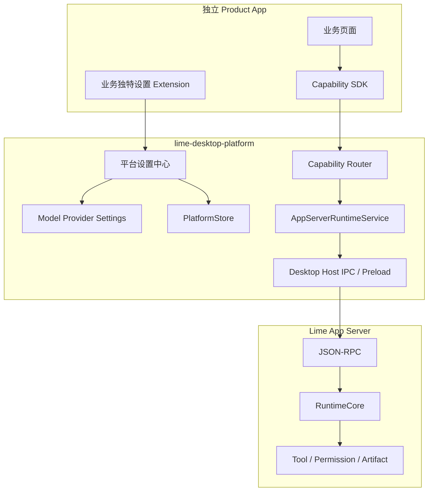
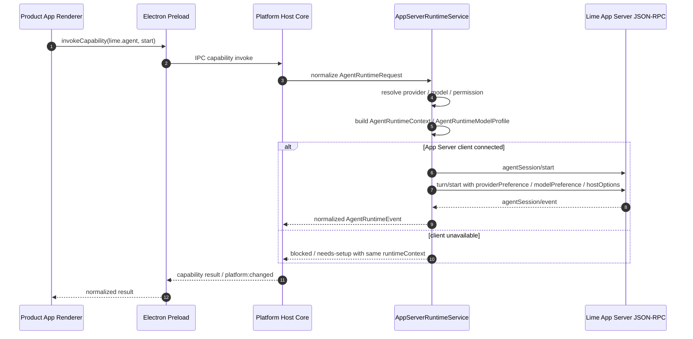

# Agent Runtime 策略

## 1. 结论

`lime-desktop-platform` 的 Agent Runtime current 路线是接入 Lime App Server JSON-RPC / RuntimeCore，而不是在桌面平台内继续实现 Pi agent 或 Claude SDK backend。

事实源关系：

- `/Users/coso/Documents/dev/ai/aiclientproxy/lime/internal/roadmap/appserver` 是 App Server JSON-RPC / RuntimeCore 路线图事实源。
- `/Users/coso/Documents/dev/ai/limecloud/agentapp` 是 Agent App / 应用中心标准事实源。
- `lime-desktop-platform` 是桌面宿主、公共能力、设置中心和 App Server bridge 的实现方。
- Product App 只消费 Host Snapshot、Capability SDK、`PlatformNavigationIntent` 和平台设置投影。
- Pi agent、Claude SDK 和 MCP SDK 不进入公开 contracts，也不再作为 current/proposed backend 路线。

一句话：平台要实现的是 `lime.agent` 到 App Server JSON-RPC 的 host-mediated bridge，不是在 Electron 主进程里再造第二套 Agent 后端。

## 2. Current 架构

```mermaid
flowchart TB
  subgraph Product[独立 Product App]
    UI[业务页面]
    SDK[Capability SDK]
    Extension[业务独特设置 Extension]
  end

  subgraph Platform[lime-desktop-platform]
    Settings[平台设置中心]
    Providers[Model Provider Settings]
    Store[PlatformStore]
    CapRouter[Capability Router]
    Runtime[AppServerRuntimeService]
    Bridge[Desktop Host IPC / Preload]
  end

  subgraph AppServer[Lime App Server]
    JsonRpc[JSON-RPC]
    RuntimeCore[RuntimeCore]
    Tools[Tool / Permission / Artifact]
  end

  UI --> SDK
  Extension --> Settings
  SDK --> CapRouter
  Settings --> Providers
  Settings --> Store
  CapRouter --> Runtime
  Runtime --> Bridge
  Bridge --> JsonRpc
  JsonRpc --> RuntimeCore
  RuntimeCore --> Tools
```

设计重点：

- current capability 是 `lime.agent`。
- `lime.agentExecution` 只作为 deprecated compat alias。
- `agentRuntime.bridge.kind` 固定为 `app-server-json-rpc`。
- Electron 只负责 Desktop Host IPC、preload 白名单、sidecar 生命周期和状态投影。
- App Server client 已有最小 JSON-RPC / stdio sidecar lifecycle；未配置、未连接或握手失败时必须 fail closed，返回 `blocked` 或 `needs-setup`，不能回退 mock、Pi agent 或 Claude SDK。

## 3. JSON-RPC Method Mapping

`AppServerRuntimeService` 当前 profile：

| 平台语义 | App Server JSON-RPC method |
| --- | --- |
| initialize | `initialize` |
| initialized | `initialized` |
| startSession | `agentSession/start` |
| readSession | `agentSession/read` |
| startTurn | `agentSession/turn/start` |
| cancelTurn | `agentSession/turn/cancel` |
| respondAction | `agentSession/action/respond` |
| listCapabilities | `capability/list` |
| readArtifact | `artifact/read` |
| exportEvidence | `evidence/export` |
| events | `agentSession/event` |

事件归一化：

- `message.delta`
- `tool.call`
- `tool.result`
- `action.required`
- `needs-setup`
- `blocked`
- `completed`
- `failed`
- `canceled`

## 4. Provider 设置边界

平台设置中心是 provider 设置事实源，Product App 不复制 provider 设置 UI。

模型设置到 App Server 的传递链路必须是 host-mediated：

1. Product App 只发起 `lime.agent` capability 请求，可携带任务、附件、`modelPolicy.preferredModelId`、`runtimeOptions.modelId` 和 `permissionMode`。
2. Desktop Host 从平台设置中心读取当前 `ModelSettings`，解析 enabled provider、目标 model、capability 和权限模式。
3. Desktop Host 在 `settings.saveModel` 保存路径做受控 provisioning：把非敏感 provider metadata 写入 App Server `modelProvider/list/read/create/update`，并把设置页输入的临时 API Key 只转交 `modelProviderKey/create`。旧 Desktop Credential Broker 仅作为缺少 `credentialSyncedAt` marker 时的一次性迁移 source，不再承接新 key 写入。App Server 返回的真实 provider id 会保存为非敏感 `desktopProviderId -> appServerProviderId` 映射。
4. Desktop Host 生成非敏感 `AgentRuntimeContext`，其中 `modelProfile` 是给 App Server JSON-RPC / RuntimeCore 的唯一模型投影。`credentialRef.providerId` 指向 provider projection id；`provider.appServerProviderId` 表示 App Server provider store 中的真实 id。
5. `AppServerJsonRpcClient.startAgentRun(...)` 必须按 App Server current schema 发送 `agentSession/start`，再在 `agentSession/turn/start.params.runtimeOptions` 写入 `providerPreference` / `modelPreference`；`providerPreference` 优先使用已同步的 App Server provider id。同一份非敏感上下文只进入 `runtimeOptions.hostOptions.desktopPlatformRuntimeContext`，不写入 App Server 当前不消费的 `agentSession/start.params.runtimeContext` 或 `runtimeOptions.runtimeContext` 假字段。
6. App Server / RuntimeCore 只消费这些 JSON-RPC 参数和 App Server provider store，不反向读取平台 JSON，也不接受 Product App 私传 provider key。`modelProviderKey/create` 是设置同步控制面，不是 runtime turn payload；`modelProviderKey/next` 会返回明文 key，Desktop Host 不在 Product App invoke 或 runtime handoff 路径调用它。

App Server provider projection 只能投影 App Server 明确返回的 `customModels` / `custom_models`。Desktop Host 不得按 provider type 合成 `gpt-*`、`claude-*`、`gemini-*` 或本地默认模型；没有显式模型 ID 的 provider 即使已经同步 key，也必须保持 `needs-setup`，不能进入 live Agent Runtime。

`ModelProviderConfig` 必须覆盖：

- `id`
- `displayName`
- `protocol`
- `capabilityKinds`
- `enabled`
- `apiKeyConfigured`
- `authType`
- `baseUrl`
- `useResponsesApi`
- `models`

普通 JSON 设置只保存 `apiKeyConfigured` 状态，不保存明文 API Key。模型 Provider key 只能进入 App Server provider store；OAuth token 和 refresh token 必须走平台宿主凭证边界，不能进入 `ModelSettings`、Product App 设置、Host Snapshot、runtime event 或 JSON-RPC payload。

`AgentRuntimeModelProfile` 只允许包含非敏感字段：

- `settingsVersion`
- `provider.id`
- `provider.appServerProviderId`
- `provider.protocol`
- `provider.authType`
- `provider.baseUrl`
- `provider.useResponsesApi`
- `provider.capabilityKinds`
- `provider.credentialConfigured`
- `provider.credentialRef`
- `modelId`
- `requestedModelId`
- `capability`

`AgentRuntimeContext` 必须同时包含：

- `protocol: 'appserver.runtimeContext'`
- `version: 1`
- `source: 'desktop-platform-model-settings'`
- `permissionMode`
- `credentialPolicy.handoff: 'credential-ref-only'`
- `credentialPolicy.plaintextSecrets: false`
- `credentialPolicy.resolver: 'app-server-provider-store' | 'desktop-host-credential-broker'`
- `credentialPolicy.runtimeStatus`
- `credentialPolicy.productionInjectionReady`

`credentialRef` 只表示“凭证已由宿主配置并可由 App Server provider store 解析”，例如 kind、provider id、authType、resolver、configured、storage kind、keychain-backed 状态、rotation 状态和 runtime status；current live resolver 是 `app-server-provider-store`。它不是 API Key、OAuth token 或 refresh token。`settings.saveModel` 输入中的临时 `apiKey` 只作为瞬时字段转交 App Server `modelProviderKey/create`，并从普通 `ModelSettings` 持久化 JSON 中剔除；保存设置后 Desktop Host 会用 provider/key sync record 暴露 `runtimeStatus: 'app-server-provider-ready'`、`appServerProviderId` 和非敏感 sync 状态。`broker-reference-only` 表示旧 Credential Broker 有凭证但尚未完成 App Server provider/key provisioning，live provider 会 fail-closed；完成一次迁移并写入 `credentialSyncedAt` 后不得重复读取旧 key。OAuth provider、OAuth token 轮换和生产级注入策略仍未完成。

App Server Runtime readiness 至少检查：

- 是否有 enabled provider。
- 是否有 text capability。
- 是否有可用 model。
- `authType !== 'none'` 时是否已有凭证配置状态。
- `authType !== 'none'` 时 App Server provider store 是否达到生产级注入状态；只有 `runtimeStatus: 'app-server-provider-ready'` 才能把 live provider 判为 ready，旧 `resolver-ready` 仅作为兼容诊断态。
- App Server client 是否已连接。

## 5. Product App 设置边界

平台基础设置全部由 `lime-desktop-platform` 实现：账号、模型 provider、网络、搜索、开放网关、数据、安全、更新、关于等都属于公共设置中心。

业务 App 只能开放自己的独特设置入口，通过 Product Settings extension 接入设置弹窗：

- `appId`
- `namespace`
- `scope: 'workspace' | 'user'`
- `render(context)`
- `onSaveSettings(value)`

存储分层：

- workspace scope：`.lime-desktop/product-settings/<appId>/<namespace>.json`
- user scope：`userData/state/product-settings/<appId>/<namespace>.json`

业务 App 独特设置不得保存平台基础设置、OAuth token、模型 API Key、billing 账本或权限权威状态；凭证、token、API Key 和 OAuth 类 namespace / key 会被宿主拒绝。

## 6. 进程边界

```mermaid
sequenceDiagram
  autonumber
  participant App as Product App Renderer
  participant Preload as Electron Preload
  participant Host as Platform Host Core
  participant Runtime as AppServerRuntimeService
  participant Server as Lime App Server JSON-RPC

  App->>Preload: invokeCapability(lime.agent, start)
  Preload->>Host: IPC capability invoke
  Host->>Runtime: normalize AgentRuntimeRequest
  Runtime->>Runtime: resolve provider / model / permission
  Runtime->>Runtime: build AgentRuntimeContext / AgentRuntimeModelProfile
  alt App Server client connected
    Runtime->>Server: agentSession/start
    Runtime->>Server: turn/start with providerPreference / modelPreference / hostOptions
    Server-->>Runtime: agentSession/event
    Runtime-->>Host: normalized AgentRuntimeEvent
  else client unavailable
    Runtime-->>Host: blocked / needs-setup with same runtimeContext
  end
  Host-->>Preload: capability result / platform:changed
  Preload-->>App: normalized result
```

Renderer 不能 spawn、不能读 token、不能 import Pi SDK / Claude SDK。

App Server client 不可用、未配置 `APP_SERVER_BIN` 或初始化失败时，`AppServerRuntimeService` 仍必须 fail closed；但 `blocked` event/result 也要携带同一个 `runtimeContext` / `modelProfile`。这不是伪执行成功，而是证明“平台设置中心 -> Desktop Host -> App Server JSON-RPC”交接契约已经稳定。注入测试 client 或配置化 stdio sidecar 可走 `started` 路径；开发态 live sidecar smoke 已覆盖 `initialize`、`capability/list`、`agentSession/start` 和 `agentSession/turn/start` 到 RuntimeCore backend 边界。packaged resources manifest 解析、相对路径约束、sha256 校验和 mock backend 阻断已有单元测试；`smoke:app-server-sidecar:packaged` 已覆盖 packaged-resource staging 启动真实 App Server；`smoke:app-server-sidecar:event-stream` 已用真实 App Server 的 external backend fixture 验证 `message.delta` / `turn.completed` 通过 `agentSession/event` 推送到客户端，并通过 `agentSession/read` 读回同一 session 的 turn 和用户消息 read model。`smoke:app-server-sidecar:package-resources` 可指向现有 Electron resources 或 package dir 验证资源形状和真实 stdio 启动，但不等同于已生成 Electron packaged artifact。Electron packaged artifact smoke 和真实 provider / RuntimeBackend live streaming 仍是后续验收项。

## 7. 治理分类

- `current`：`lime.agent` capability、`AppServerRuntimeService`、`AgentRuntimeBridgeProfile`、`AgentRuntimeContext`、`AgentRuntimeModelProfile`、App Server JSON-RPC method mapping、provider 设置、Product App 设置 namespace、fail-closed readiness。
- `compat`：`lime.agentExecution` alias、runtime-backed conformance fixture、`referenceRuntime`。
- `deprecated`：Product App 或 conformance fixture 仍直接请求 `lime.agentExecution` capability 名称的调用点；退出条件跟随 Product App 全量切换到 `lime.agent`。
- `dead`：`src/main/services/agentExecution/**` 旧 backend router / descriptor / Claude-Pi not-installed adapter、`src/main/services/agentExecutionService.ts` re-export、Pi agent backend、Claude SDK backend、Product App 直接 import provider SDK、生产路径回退 mock backend、把真实 Product App 塞进平台运行时 catalog。

## 8. 落地切片

### P0: 契约与文档

- `lime.agent` current capability。
- `lime.agentExecution` compat alias。
- App Server JSON-RPC bridge profile。
- host-mediated `AgentRuntimeContext` / `AgentRuntimeModelProfile` handoff。
- provider 设置和 Product App 设置 namespace 文档。

### P1: Fail-Closed Runtime Service

- `AppServerRuntimeService` 返回 `blocked` / `needs-setup` / normalized event。
- diagnostics 输出 App Server bridge profile。
- blocked event/result 输出同一份非敏感 `runtimeContext`，证明 provider/model handoff 契约。
- smoke 验证不会回退 Pi agent、Claude SDK 或 mock backend。

### P2: Provider 设置保存与凭证托管

- 设置中心支持 provider 名称、Base URL、API 格式、Responses API、API Key 配置状态和模型优先级。
- `settings.saveModel` 持久化 `ModelSettings`。
- App Server provider store 保存模型 API Key；旧 Credential Broker 仅作为一次性迁移 source，普通 `ModelSettings` JSON 只保留 `apiKeyConfigured`。
- OS keychain、OAuth token 轮换、过期刷新和生产级 credential injection 仍未完成。

### P3: Product App 设置托管

- contracts / shared types 暴露 `ProductAppSettingsRecord`。
- IPC / preload / host-core 暴露 read/write。
- Store 按 `appId + namespace + scope` 独立落盘。
- Store 阻断凭证、token、API Key 和 OAuth 类 namespace / key；模型 Provider key 只能走 App Server provider store，其他敏感凭证必须走平台宿主凭证边界。
- React 设置弹窗支持业务设置扩展分组。

### P4: App Server Client

- 接入 Lime App Server JSON-RPC client。
- 配置化连接 stdio sidecar lifecycle；开发态可通过 `APP_SERVER_BIN` 指向本地 binary，生产必须走 packaged resources / manifest / sha256。
- 把 `agentSession/event` 投影到 runtime events。
- 已有单元测试覆盖 protocol order、runtime hostOptions handoff、event projection、sidecar spawn、`process.resourcesPath/app-server/manifest.json` 解析、binary sha256 校验、资源相对路径约束和 mock backend 阻断；`npm run smoke:app-server-sidecar` 可显式验证开发态 live sidecar，`npm run smoke:app-server-sidecar:packaged` 可验证 packaged-resource staging sidecar，`npm run smoke:app-server-sidecar:event-stream` 可用真实 App Server + external backend fixture 验证 `agentSession/event` 事件推送管道和 `agentSession/read` read model，`APP_SERVER_RESOURCE_DIR=/path/to/resources/app-server npm run smoke:app-server-sidecar:package-resources` 可验证现有 Electron resources / package dir，后续补真实 Electron packaged artifact smoke 和真实 provider / RuntimeBackend live streaming。

### P5: Tauri Adapter

- 复用同一 JSON-RPC bridge profile。
- Tauri 只替换宿主 IPC / sidecar 生命周期，不改公开协议。

## 9. 必须守住的风险

| 风险 | 约束 |
| --- | --- |
| SDK 污染公开契约 | contracts 只出现平台语义和 App Server JSON-RPC method，不出现 Pi / Claude SDK 类型。 |
| Product App 重做设置 | 平台基础设置只在平台实现；业务独特设置走 namespace。 |
| 模型设置断链 | Desktop Host 必须把设置中心解析成 `AgentRuntimeContext.modelProfile` 后再调用 App Server；Product App 不能直传 provider secret。 |
| 事件协议分叉 | 所有 runtime event 先归一化为 `AgentRuntimeEvent`。 |
| 生产 mock 成功 | client 不可用或未配置时 fail closed。 |
| 存储混乱 | userData/state、`.lime-desktop/`、product-settings namespace 分层。 |
