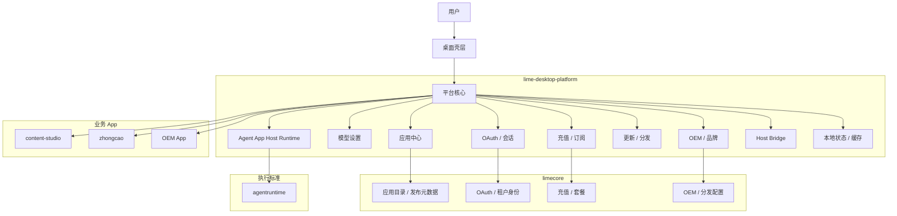
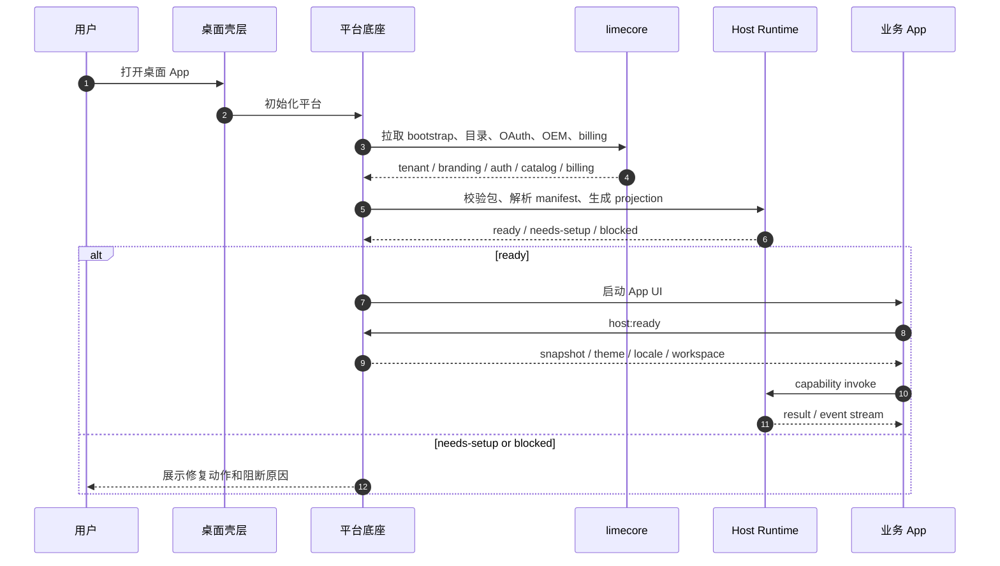
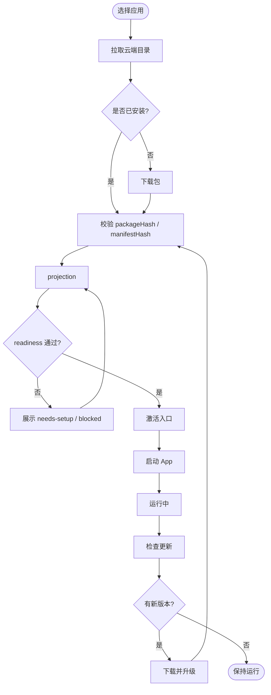
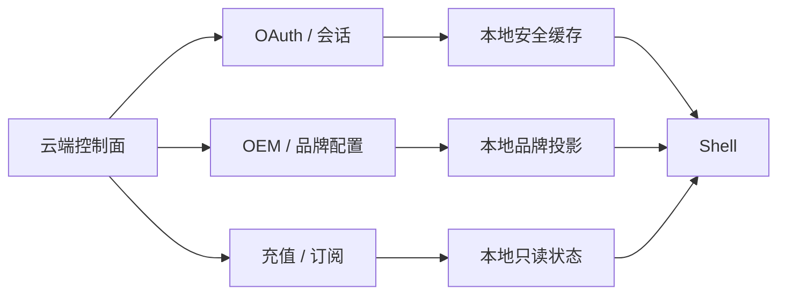
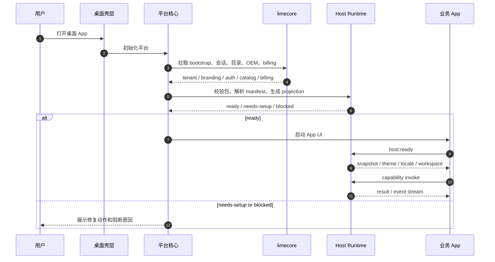
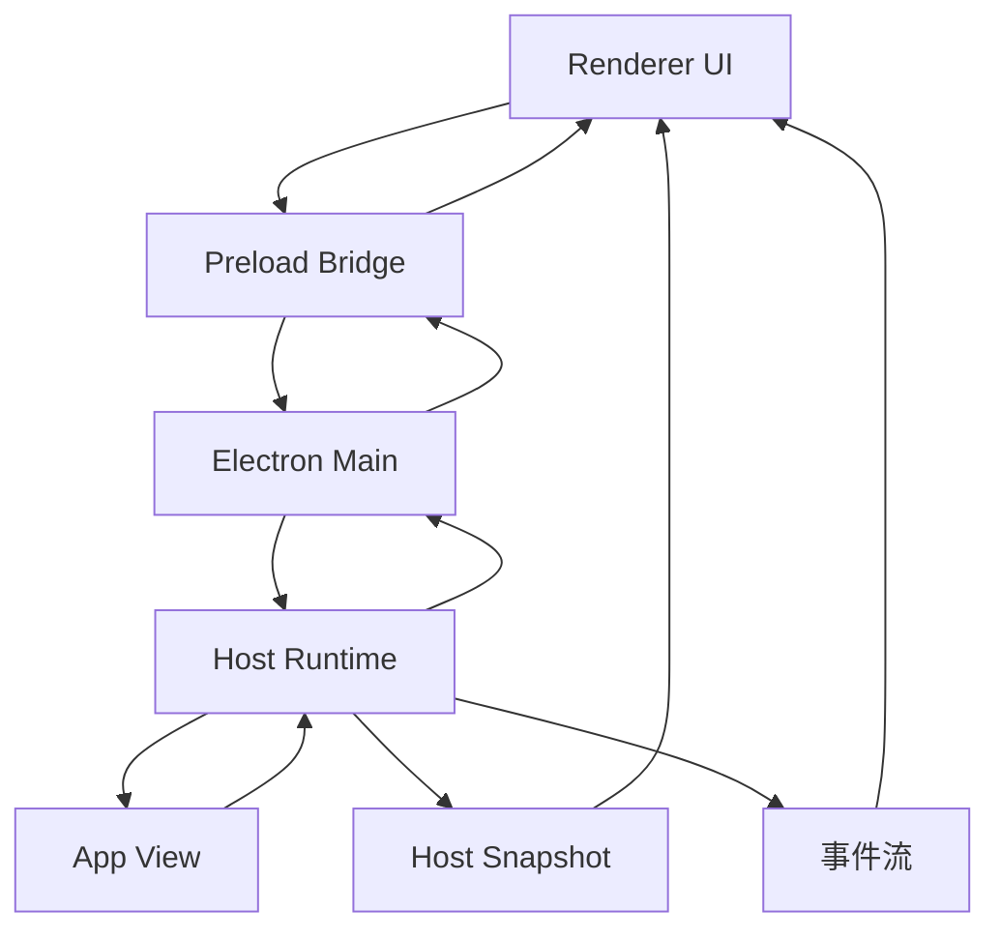
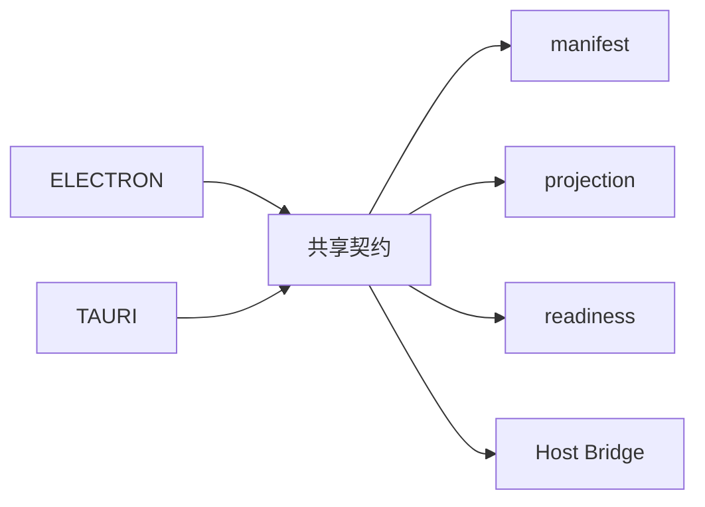

# 架构与流程图

## 1. 设计结论

平台的核心是四层：桌面壳层、平台底座、云端控制面、执行标准。`content-studio`、`zhongcao` 和后续 OEM App 只消费平台，不各自重造登录、模型设置、应用中心和更新逻辑。

## 2. 总体架构图

## 3. 启动时序图

## 4. 安装与更新流程图

## 5. OAuth / OEM / 充值同步图

## 6. 启动时序图

## 7. Host Bridge 生命周期图

## 8. 适配关系

## 9. 约束

- 图里的所有状态都必须能落到 `src/shared/types.ts`。
- 任何 UI 行为都要能回到 manifest / projection / readiness / bridge 之一。
- Electron 和 Tauri 可以不同实现，但不能不同语义。
- blocked、needs-setup 和 ready 不能在图里被画成同一个状态。
