# 架构与流程图

## 1. 设计结论

`agentapp` 是 Agent App / 应用中心标准事实源。`lime-desktop-platform` 是 Lime 桌面产品线的公共底座，交付形态是 contracts、host-core、公共 UI modules、Electron adapter、Tauri adapter 和 reference shell。

`content-studio`、`zhongcao`、`limecore` OEM App 都是独立 Product App。它们不是 `lime-desktop-platform` 的子 App，也不应该由平台在生产路径里托管成子进程。正式 Product App 在自己的 Electron / Tauri 壳内引入平台 contracts、host-core、UI modules 和 adapter，消费 Host Snapshot、Capability SDK、公共设置、OAuth、billing、OEM、更新和应用中心能力。

`samples/platform-conformance`、`referenceRuntime`、`LIME_HOST_SNAPSHOT`、`LIME_RUNTIME_BRIDGE` 和 runtime-backed reference shell 只用于 smoke、conformance 和本地联调。它们证明协议可用，不定义正式产品架构。平台 App 不内置 `zhongcao` 或 `content-studio` 这样的同名 Product App。

## 2. 目标架构图

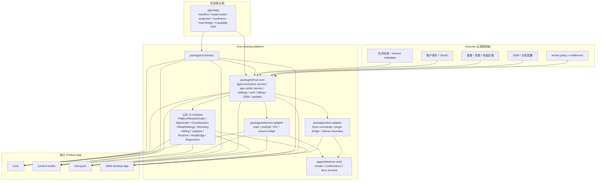

说明：Product App 是平台能力的消费者，不是平台应用中心里的“子 App”。平台应用中心和产品内 agentapp 应用中心可以共存，但都必须回到 `agentapp` 标准和同一组平台能力契约。公共页面同样只有一套事实源，当前代码落在 `src/renderer/src/platformModules.tsx`，后续拆成 `@limecloud/desktop-platform-react` 或同等 UI package。

## 3. 包边界图

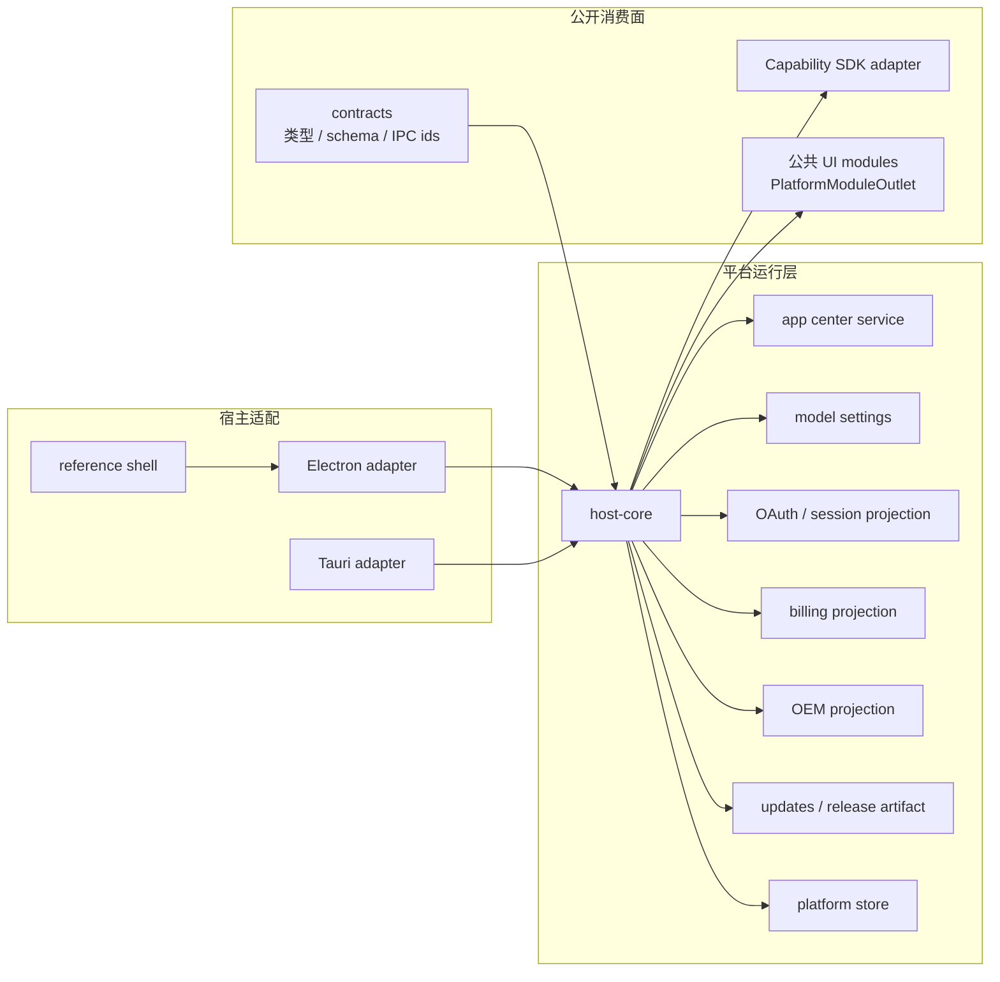

## 4. Ownership 图

```mermaid
flowchart LR
  subgraph PlatformOwns[lime-desktop-platform owns]
    P1[contracts / schema]
    P2[host-core]
    P3[agentapp Host Runtime]
    P4[平台级应用中心 service + UI module]
    P5[模型设置]
    P6[OAuth / 会话投影]
    P7[OEM / 品牌投影]
    P8[充值 / 订阅投影]
    P9[更新 / 分发投影]
    P10[Electron / Tauri adapters]
  end

  subgraph AppOwns[Product App owns]
    A1[产品壳装配]
    A2[业务页面]
    A3[业务 workspace]
    A4[产品内 agentapp package]
    A5[业务 workflow / artifacts]
    A6[领域 readiness 展示]
  end

  PlatformOwns -->|Host Snapshot / UI modules / Capability SDK| AppOwns
  AppOwns -->|PlatformNavigationIntent / capability invoke| PlatformOwns
```

## 5. 标准到实现映射图

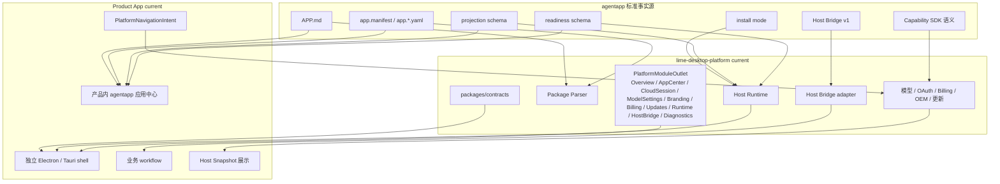

## 6. Product App 启动时序图

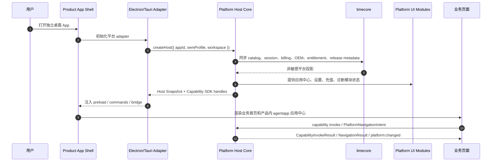

说明：正式 Product App 由自己的安装包启动。平台底座在 App 内初始化，不反向把 Product App 当成平台子进程。

## 7. 平台级应用中心流程图

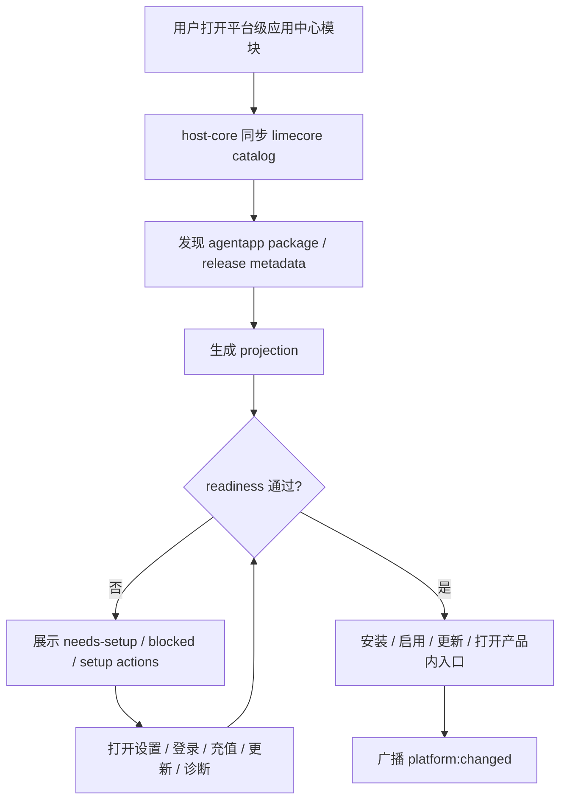

## 8. 产品内 agentapp 应用中心时序图

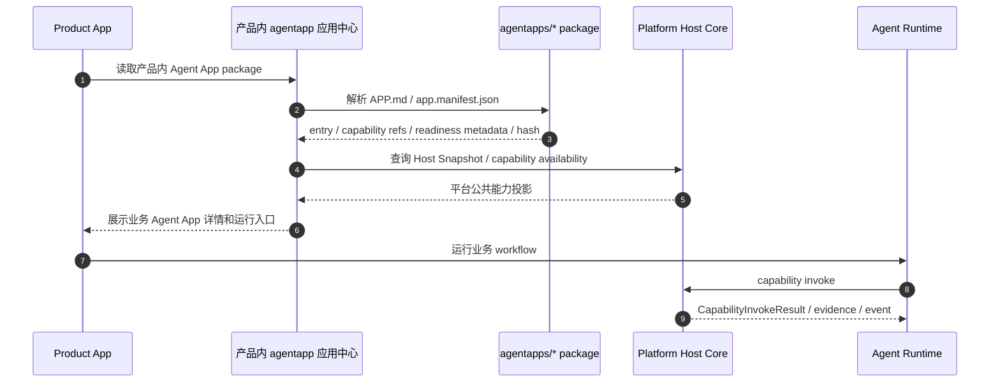

说明：`zhongcao` 的 GEO 草稿、STREAM 预检、Schema 增强和发布 readiness 属于产品内 agentapp package；OAuth、模型设置、billing、OEM、更新和平台级应用中心属于平台底座。

## 9. Host Snapshot 流程图

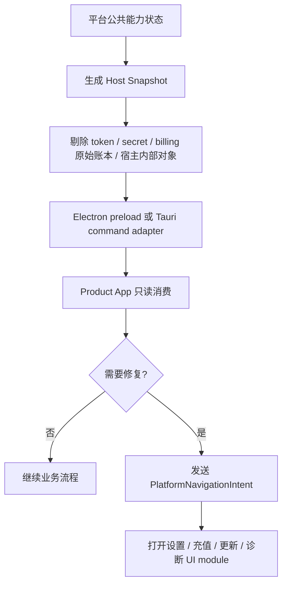

## 10. 公共能力调用时序图

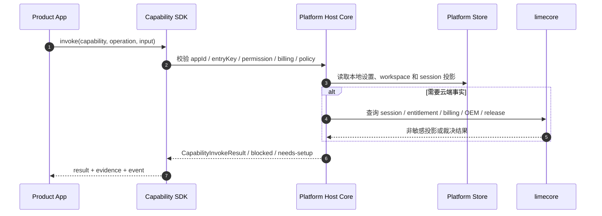

## 11. 安装、更新与卸载边界图

### 11.1 Product App 自身更新

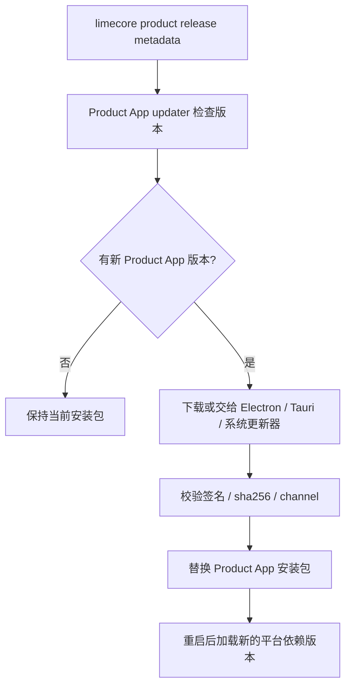

### 11.2 agentapp package 安装 / 更新

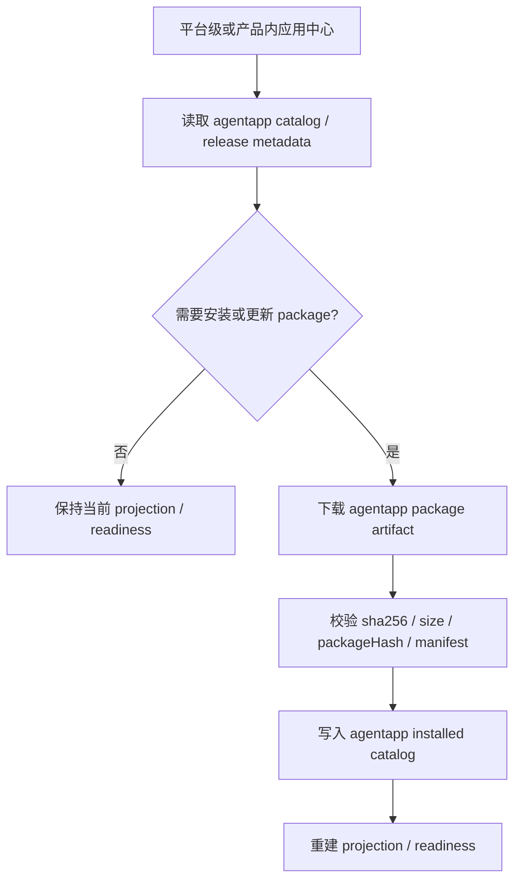

### 11.3 agentapp package 禁用 / 卸载

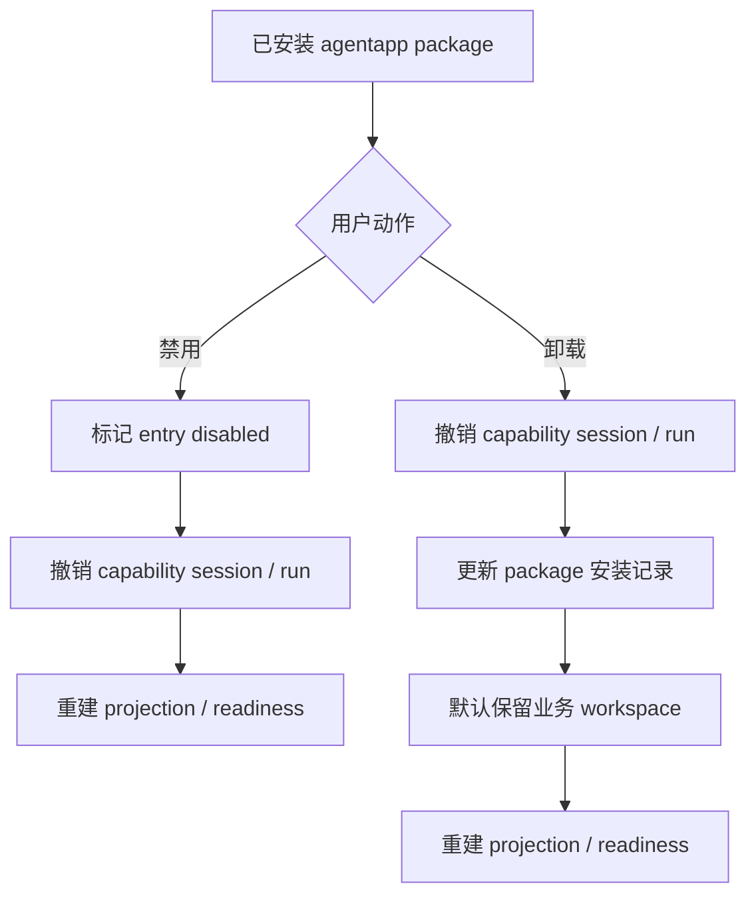

### 11.4 平台底座版本

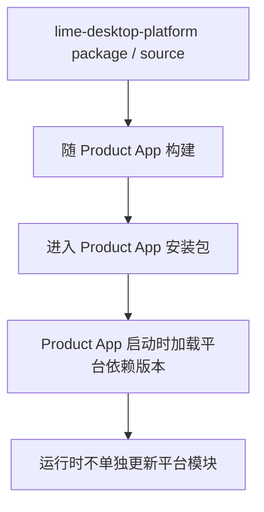

说明：

- Product App 自身更新由产品安装器、Electron updater、Tauri updater 或系统包管理器负责；平台底座只提供 release metadata 投影、更新状态和导航入口，不写 `agentapp` 安装表。
- `agentapp package` 的安装、更新、禁用和卸载由 Host Runtime 管理，写入的是 package installed catalog，并触发 projection / readiness 重算。
- `lime-desktop-platform` 在 v1 作为 Product App 的依赖和宿主模块随应用构建发布，不设计运行时“单独更新平台模块”的安装表。
- 停止 reference runtime 子进程只属于 smoke / reference fixture，不是正式 Product App 更新或卸载模型。

## 12. Reference Fixture 流程图

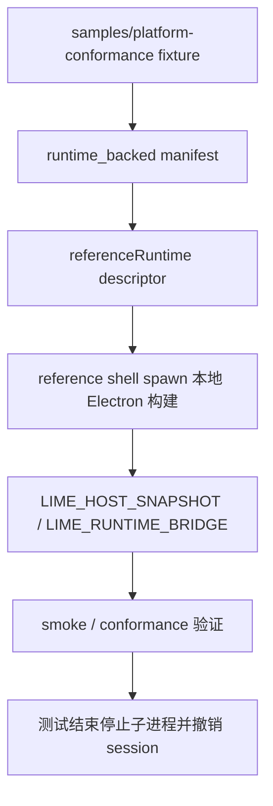

说明：这条路径是 `compat`。它可以保留用于测试，但不能作为 `content-studio`、`zhongcao` 或 OEM App 的生产启动模型。

## 13. 平台变化事件图

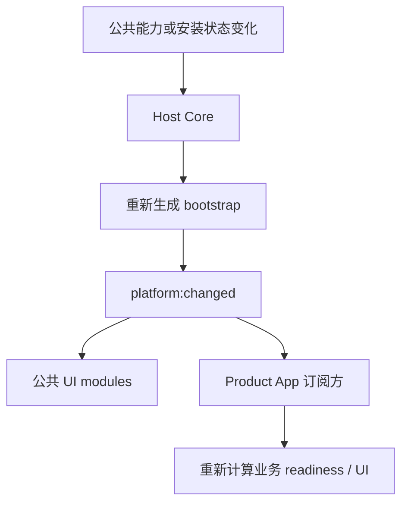

## 14. 适配关系图

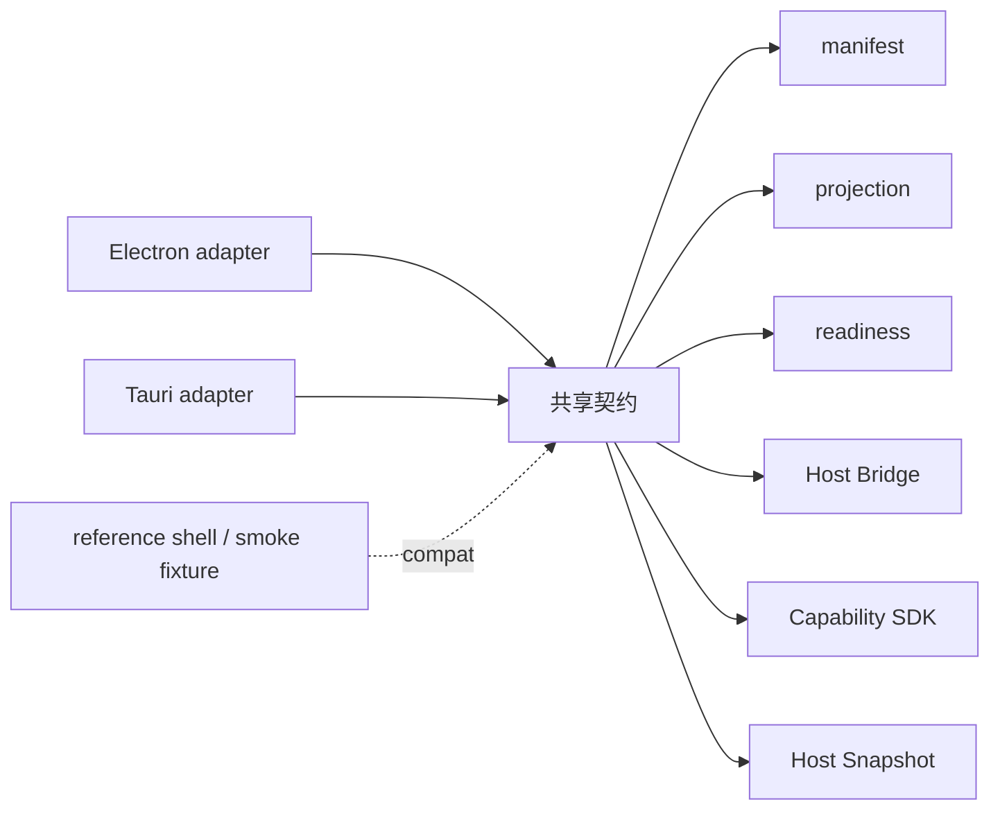

## 15. 开发到发布流程图

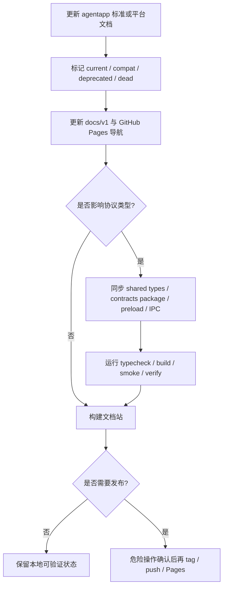

## 16. Agent Execution Runtime 参考架构

Claude SDK 和 Pi 的位置在 `host-core` 后面，不在 Product App 前面。Product App 通过 Capability SDK 发起 agent execution，平台根据模型设置、OAuth、billing、权限和工具策略选择 backend。

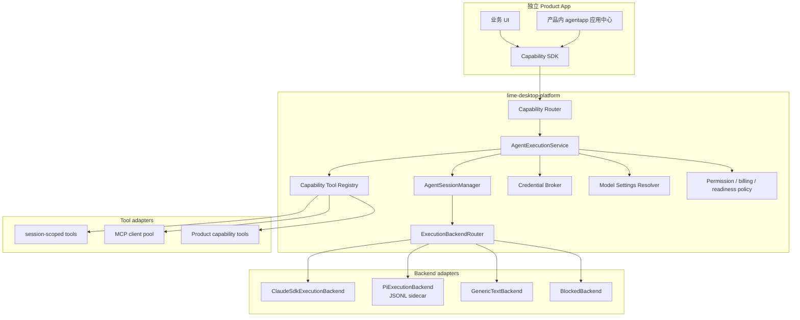

参考 `/Users/coso/Documents/dev/js/craft-agents-oss` 后的采纳结论：

- Claude SDK 适合作为 Claude 原生 agent backend，提供 `query()`、MCP server、PreToolUse、resume/fork 和事件流能力。
- Pi 适合作为多 provider agent backend，但必须通过 sidecar / JSONL 隔离 heavy dependency、ESM bundling、auth storage 和崩溃风险。
- session tools 应有单一 schema 事实源，再生成 Claude tool、Pi proxy tool 和 MCP JSON Schema。
- 模型连接、OAuth、token refresh、runtime config signature 属于平台模型设置和 Credential Broker，不属于 Product App 私有实现。

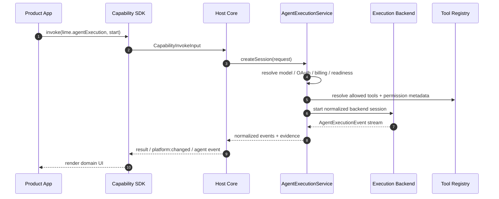

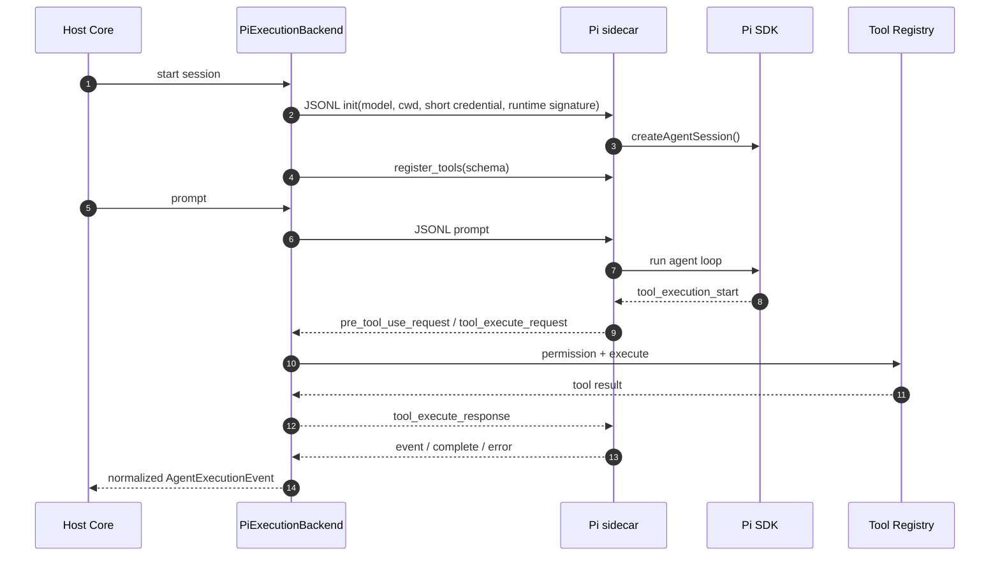

这条链路是 `proposed-current`：文档边界已明确，具体代码尚未落地。当前代码中的 runtime-backed reference shell 仍只属于 `compat` conformance 路径。

## 17. 治理分类

- `current`：`agentapp` 标准、`lime-desktop-platform` contracts / host-core / UI modules / Electron adapter / Tauri adapter、Host Snapshot、Capability SDK、`PlatformNavigationIntent`、`lime.agentExecution` capability、`AgentExecutionService` blocked backend、Product App 独立运行并消费平台能力、Product App 产品内 Agent App package。
- `proposed-current`：`AgentSessionManager`、Execution Backend Router、Claude SDK backend、Pi sidecar backend、Capability Tool Registry、Tauri sidecar adapter。
- `compat`：`samples/platform-conformance`、`referenceRuntime`、`LIME_HOST_SNAPSHOT`、`LIME_RUNTIME_BRIDGE`、runtime-backed reference shell、单文件 catalog fallback。
- `deprecated`：`devRuntime` metadata、Product App 内私有模型设置、OAuth、充值、OEM、更新、平台安装表、重复应用中心协议、业务页面直接 import Claude SDK / Pi SDK。
- `dead`：把 `zhongcao`、`content-studio` 或 OEM App 当成 `lime-desktop-platform` 核心产品对象或子 App；把真实 Product App 名称作为平台内置同名 App 进入运行时 catalog；生产路径由平台应用中心托管启动 Product App 子进程；把 `lime-desktop-platform` 当作 Agent App 标准事实源；把 Claude SDK 或 Pi 当作 `agentapp` 标准事实源。
