# 架构与流程图

## 1. 设计结论

`agentapp` 是 Agent App / 应用中心标准事实源。`lime-desktop-platform` 是 Lime 桌面产品线的公共底座，交付形态是 contracts、host-core、公共 UI modules、Electron adapter、Tauri adapter 和 reference shell。

`content-studio`、`zhongcao`、`limecore` OEM App 都是独立 Product App。它们不是 `lime-desktop-platform` 的子 App，也不应该由平台在生产路径里托管成子进程。正式 Product App 在自己的 Electron / Tauri 壳内引入平台 contracts、host-core、UI modules 和 adapter，消费 Host Snapshot、Capability SDK、公共设置、OAuth、billing、OEM、更新和应用中心能力。

`samples/platform-conformance`、`referenceRuntime`、`LIME_HOST_SNAPSHOT`、`LIME_RUNTIME_BRIDGE` 和 runtime-backed reference shell 只用于 smoke、conformance 和本地联调。它们证明协议可用，不定义正式产品架构。平台 App 不内置 `zhongcao` 或 `content-studio` 这样的同名 Product App。

## 2. 目标架构图

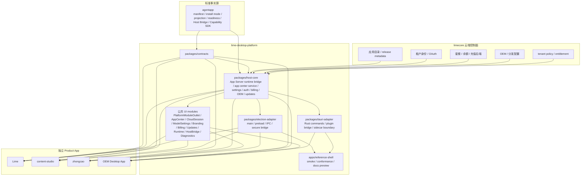
```mermaid
flowchart TB
  subgraph Standard[标准事实源]
    AgentApp[agentapp<br/>manifest / install mode / projection / readiness / Host Bridge / Capability SDK]
  end

  subgraph Platform[lime-desktop-platform]
    Contracts[packages/contracts]
    HostCore[packages/host-core<br/>App Server runtime bridge / app center service / settings / auth / billing / OEM / updates]
    UIModules[公共 UI modules<br/>PlatformModuleOutlet / AppCenter / CloudSession / ModelSettings / Branding / Billing / Updates / Runtime / HostBridge / Diagnostics]
    ElectronAdapter[packages/electron-adapter<br/>main / preload / IPC / secure bridge]
    TauriAdapter[packages/tauri-adapter<br/>Rust commands / plugin bridge / sidecar boundary]
    RefShell[apps/reference-shell<br/>smoke / conformance / docs preview]
  end

  subgraph Cloud[limecore 云端控制面]
    Catalog[应用目录 / release metadata]
    Identity[租户身份 / OAuth]
    BillingCloud[套餐 / 余额 / 充值后端]
    OEMCloud[OEM / 分发配置]
    Policy[tenant policy / entitlement]
  end

  subgraph ProductApps[独立 Product App]
    Lime[Lime]
    ContentStudio[content-studio]
    Zhongcao[zhongcao]
    OEMApp[OEM Desktop App]
  end

  AgentApp --> Contracts
  AgentApp --> HostCore

  Contracts --> HostCore
  HostCore --> UIModules
  HostCore --> ElectronAdapter
  HostCore --> TauriAdapter
  ElectronAdapter --> RefShell
  TauriAdapter --> RefShell

  Catalog --> HostCore
  Identity --> HostCore
  BillingCloud --> HostCore
  OEMCloud --> HostCore
  Policy --> HostCore

  Contracts --> Lime
  HostCore --> Lime
  UIModules --> Lime
  ElectronAdapter --> Lime

  Contracts --> ContentStudio
  HostCore --> ContentStudio
  UIModules --> ContentStudio
  ElectronAdapter --> ContentStudio

  Contracts --> Zhongcao
  HostCore --> Zhongcao
  UIModules --> Zhongcao
  ElectronAdapter --> Zhongcao

  Contracts --> OEMApp
  HostCore --> OEMApp
  UIModules --> OEMApp
  TauriAdapter --> OEMApp
```

说明：Product App 是平台能力的消费者，不是平台应用中心里的“子 App”。平台应用中心和产品内 agentapp 应用中心可以共存，但都必须回到 `agentapp` 标准和同一组平台能力契约。公共页面同样只有一套事实源：`packages/react/src/index.tsx` 和发布包 `@limecloud/desktop-platform-react`。

## 3. 包边界图

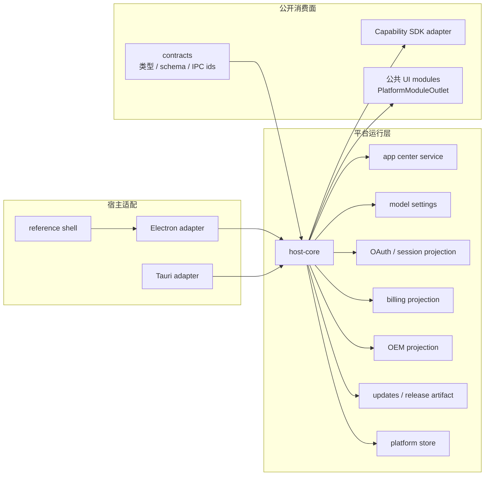
```mermaid
flowchart LR
  subgraph PublicAPI[公开消费面]
    Contracts[contracts<br/>类型 / schema / IPC ids]
    CapabilitySDK[Capability SDK adapter]
    UI[公共 UI modules<br/>PlatformModuleOutlet]
  end

  subgraph Runtime[平台运行层]
    HostCore[host-core]
    AppCenter[app center service]
    Settings[model settings]
    Auth[OAuth / session projection]
    Billing[billing projection]
    Branding[OEM projection]
    Updates[updates / release artifact]
    Store[platform store]
  end

  subgraph Adapters[宿主适配]
    Electron[Electron adapter]
    Tauri[Tauri adapter]
    Ref[reference shell]
  end

  Contracts --> HostCore
  HostCore --> AppCenter
  HostCore --> Settings
  HostCore --> Auth
  HostCore --> Billing
  HostCore --> Branding
  HostCore --> Updates
  HostCore --> Store
  HostCore --> CapabilitySDK
  HostCore --> UI
  Electron --> HostCore
  Tauri --> HostCore
  Ref --> Electron
```

## 4. Ownership 图

```mermaid
flowchart LR
  subgraph PlatformOwns[lime-desktop-platform owns]
    P1[contracts / schema]
    P2[host-core]
    P3[agentapp Host Runtime]
    P4[平台级应用中心 service + UI module]
    P5[模型设置]
    P6[OAuth / 会话投影]
    P7[OEM / 品牌投影]
    P8[充值 / 订阅投影]
    P9[更新 / 分发投影]
    P10[Electron / Tauri adapters]
  end

  subgraph AppOwns[Product App owns]
    A1[产品壳装配]
    A2[业务页面]
    A3[业务 workspace]
    A4[产品内 agentapp package]
    A5[业务 workflow / artifacts]
    A6[领域 readiness 展示]
  end

  PlatformOwns -->|Host Snapshot / UI modules / Capability SDK| AppOwns
  AppOwns -->|PlatformNavigationIntent / capability invoke| PlatformOwns
```

## 5. 标准到实现映射图

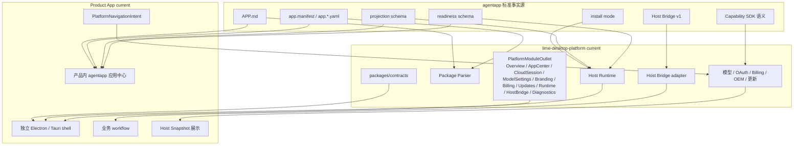
```mermaid
flowchart TB
  subgraph AgentAppStd[agentapp 标准事实源]
    AppMd[APP.md]
    Manifest[app.manifest / app.*.yaml]
    Install[install mode]
    Projection[projection schema]
    Readiness[readiness schema]
    BridgeSpec[Host Bridge v1]
    CapabilitySpec[Capability SDK 语义]
  end

  subgraph PlatformImpl[lime-desktop-platform current]
    Contracts[packages/contracts]
    Parser[Package Parser]
    HostRuntime[Host Runtime]
    HostBridge[Host Bridge adapter]
    PublicCaps[模型 / OAuth / Billing / OEM / 更新]
    PublicUI[PlatformModuleOutlet<br/>Overview / AppCenter / CloudSession / ModelSettings / Branding / Billing / Updates / Runtime / HostBridge / Diagnostics]
  end

  subgraph ProductConsumer[Product App current]
    ProductShell[独立 Electron / Tauri shell]
    ProductCenter[产品内 agentapp 应用中心]
    ProductWorkflow[业务 workflow]
    ProductSnapshot[Host Snapshot 展示]
    ProductIntent[PlatformNavigationIntent]
  end

  AppMd --> Parser
  Manifest --> Parser
  Install --> HostRuntime
  Projection --> HostRuntime
  Readiness --> HostRuntime
  BridgeSpec --> HostBridge
  CapabilitySpec --> PublicCaps

  Contracts --> ProductShell
  PublicUI --> ProductShell
  HostRuntime --> ProductShell
  HostBridge --> ProductWorkflow
  PublicCaps --> ProductSnapshot
  ProductIntent --> PublicCaps

  AppMd --> ProductCenter
  Manifest --> ProductCenter
  Projection --> ProductCenter
  Readiness --> ProductCenter
```

## 6. Product App 启动时序图

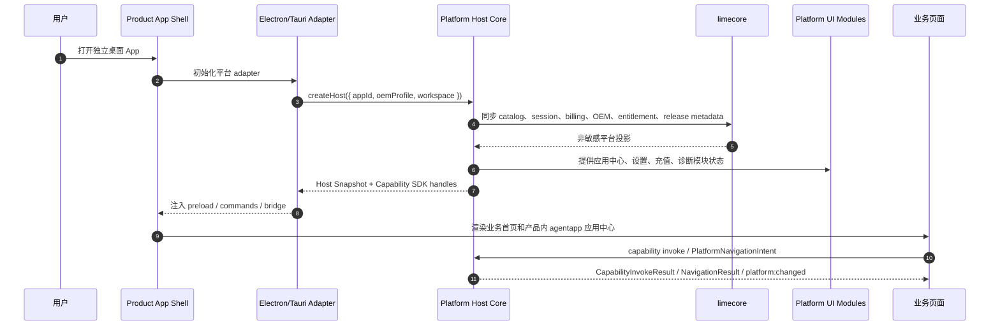
```mermaid
sequenceDiagram
  autonumber
  participant User as 用户
  participant App as Product App Shell
  participant Adapter as Electron/Tauri Adapter
  participant Core as Platform Host Core
  participant Limecore as limecore
  participant UI as Platform UI Modules
  participant Business as 业务页面

  User->>App: 打开独立桌面 App
  App->>Adapter: 初始化平台 adapter
  Adapter->>Core: createHost({ appId, oemProfile, workspace })
  Core->>Limecore: 同步 catalog、session、billing、OEM、entitlement、release metadata
  Limecore-->>Core: 非敏感平台投影
  Core->>UI: 提供应用中心、设置、充值、诊断模块状态
  Core-->>Adapter: Host Snapshot + Capability SDK handles
  Adapter-->>App: 注入 preload / commands / bridge
  App->>Business: 渲染业务首页和产品内 agentapp 应用中心
  Business->>Core: capability invoke / PlatformNavigationIntent
  Core-->>Business: CapabilityInvokeResult / NavigationResult / platform:changed
```

说明：正式 Product App 由自己的安装包启动。平台底座在 App 内初始化，不反向把 Product App 当成平台子进程。

## 7. 平台级应用中心流程图

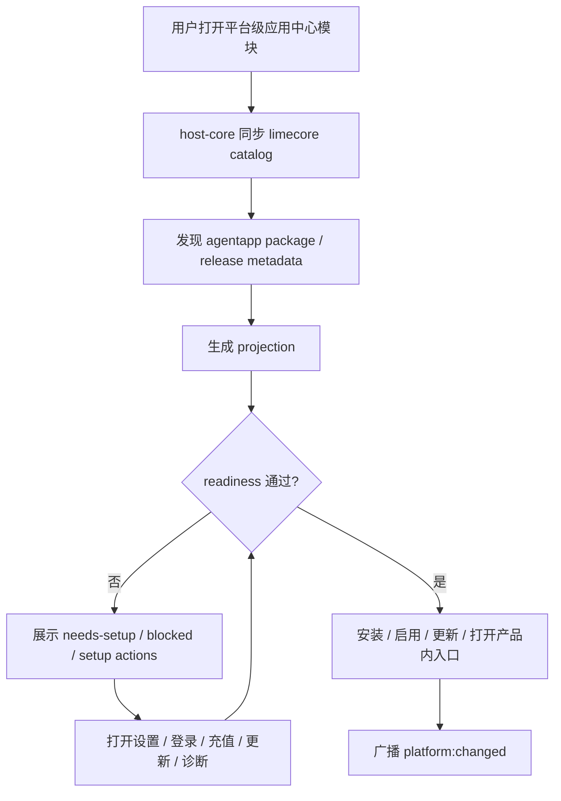
```mermaid
flowchart TD
  Open[用户打开平台级应用中心模块] --> Sync[host-core 同步 limecore catalog]
  Sync --> Discover[发现 agentapp package / release metadata]
  Discover --> Project[生成 projection]
  Project --> Ready{readiness 通过?}
  Ready -- 否 --> Setup[展示 needs-setup / blocked / setup actions]
  Setup --> Intent[打开设置 / 登录 / 充值 / 更新 / 诊断]
  Intent --> Ready
  Ready -- 是 --> Action[安装 / 启用 / 更新 / 打开产品内入口]
  Action --> Event[广播 platform:changed]
```

## 8. 产品内 agentapp 应用中心时序图

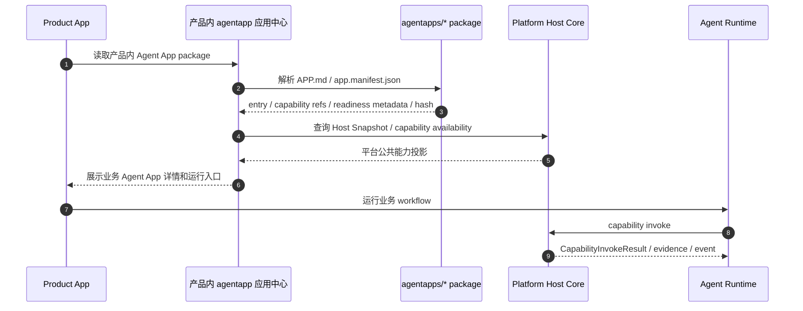
```mermaid
sequenceDiagram
  autonumber
  participant App as Product App
  participant Center as 产品内 agentapp 应用中心
  participant Package as agentapps/* package
  participant Core as Platform Host Core
  participant Runtime as Agent Runtime

  App->>Center: 读取产品内 Agent App package
  Center->>Package: 解析 APP.md / app.manifest.json
  Package-->>Center: entry / capability refs / readiness metadata / hash
  Center->>Core: 查询 Host Snapshot / capability availability
  Core-->>Center: 平台公共能力投影
  Center-->>App: 展示业务 Agent App 详情和运行入口
  App->>Runtime: 运行业务 workflow
  Runtime->>Core: capability invoke
  Core-->>Runtime: CapabilityInvokeResult / evidence / event
```

说明：`zhongcao` 的 GEO 草稿、STREAM 预检、Schema 增强和发布 readiness 属于产品内 agentapp package；OAuth、模型设置、billing、OEM、更新和平台级应用中心属于平台底座。

## 9. Host Snapshot 流程图

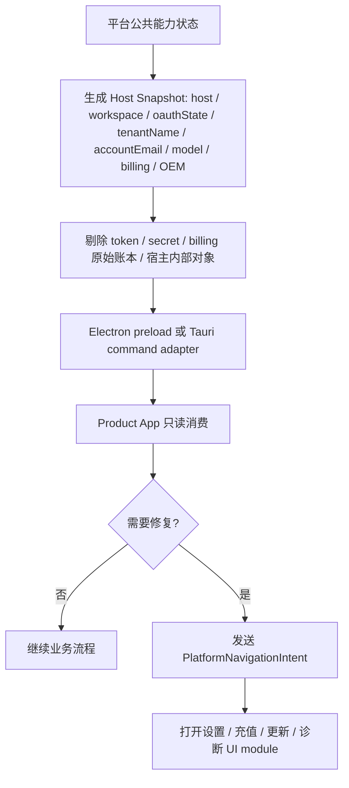
```mermaid
flowchart TD
  State[平台公共能力状态] --> Snapshot[生成 Host Snapshot: host / workspace / oauthState / tenantName / accountEmail / model / billing / OEM]
  Snapshot --> Filter[剔除 token / secret / billing 原始账本 / 宿主内部对象]
  Filter --> Adapter[Electron preload 或 Tauri command adapter]
  Adapter --> AppUI[Product App 只读消费]
  AppUI --> NeedFix{需要修复?}
  NeedFix -- 否 --> Run[继续业务流程]
  NeedFix -- 是 --> Intent[发送 PlatformNavigationIntent]
  Intent --> PlatformUI[打开设置 / 充值 / 更新 / 诊断 UI module]
```

## 10. 公共能力调用时序图

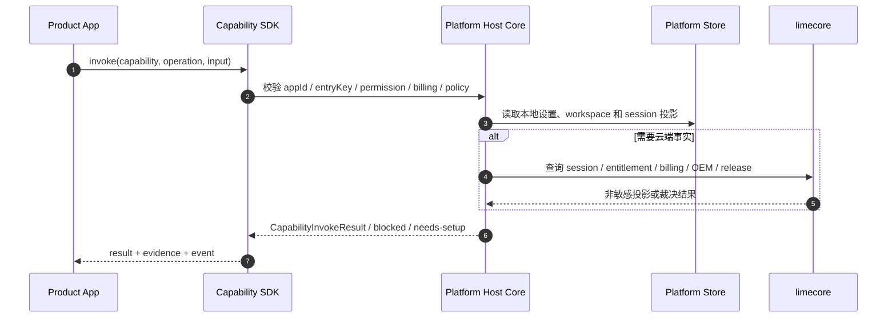
```mermaid
sequenceDiagram
  autonumber
  participant App as Product App
  participant SDK as Capability SDK
  participant Core as Platform Host Core
  participant Store as Platform Store
  participant Cloud as limecore

  App->>SDK: invoke(capability, operation, input)
  SDK->>Core: 校验 appId / entryKey / permission / billing / policy
  Core->>Store: 读取本地设置、workspace 和 session 投影
  alt 需要云端事实
    Core->>Cloud: 查询 session / entitlement / billing / OEM / release
    Cloud-->>Core: 非敏感投影或裁决结果
  end
  Core-->>SDK: CapabilityInvokeResult / blocked / needs-setup
  SDK-->>App: result + evidence + event
```

## 11. 安装、更新与卸载边界图

### 11.1 Product App 自身更新

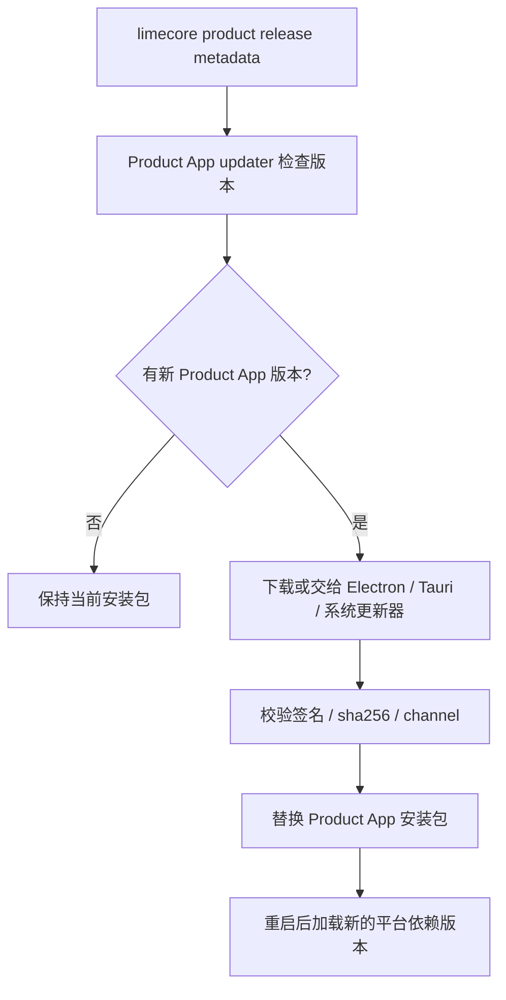
```mermaid
flowchart TD
  ProductMeta[limecore product release metadata] --> ProductCheck[Product App updater 检查版本]
  ProductCheck --> ProductHas{有新 Product App 版本?}
  ProductHas -- 否 --> ProductReady[保持当前安装包]
  ProductHas -- 是 --> ProductDownload[下载或交给 Electron / Tauri / 系统更新器]
  ProductDownload --> ProductVerify[校验签名 / sha256 / channel]
  ProductVerify --> ProductApply[替换 Product App 安装包]
  ProductApply --> ProductRestart[重启后加载新的平台依赖版本]
```

### 11.2 agentapp package 安装 / 更新

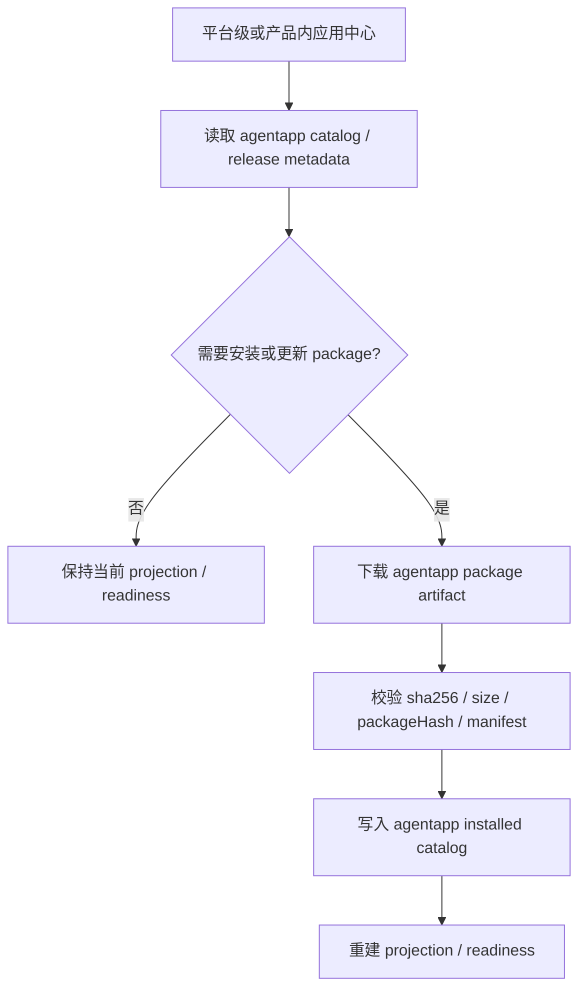
```mermaid
flowchart TD
  Center[平台级或产品内应用中心] --> Catalog[读取 agentapp catalog / release metadata]
  Catalog --> Candidate{需要安装或更新 package?}
  Candidate -- 否 --> Ready[保持当前 projection / readiness]
  Candidate -- 是 --> PackageDownload[下载 agentapp package artifact]
  PackageDownload --> PackageVerify[校验 sha256 / size / packageHash / manifest]
  PackageVerify --> PackageInstall[写入 agentapp installed catalog]
  PackageInstall --> PackageProject[重建 projection / readiness]
```

### 11.3 agentapp package 禁用 / 卸载

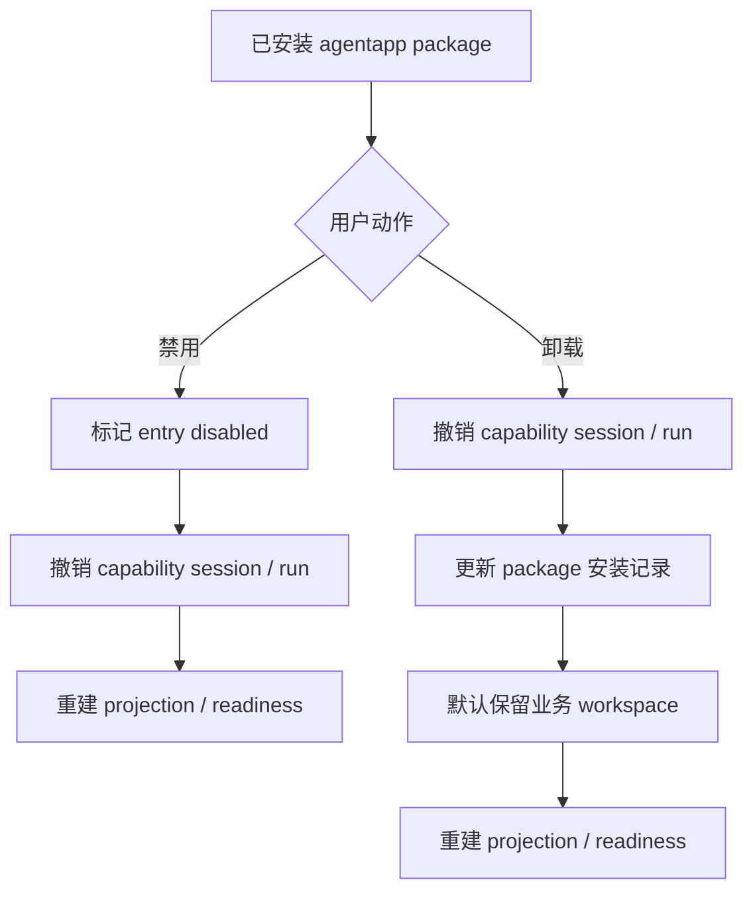
```mermaid
flowchart TD
  Installed[已安装 agentapp package] --> Action{用户动作}
  Action -- 禁用 --> Disable[标记 entry disabled]
  Disable --> RevokeA[撤销 capability session / run]
  RevokeA --> ProjectA[重建 projection / readiness]
  Action -- 卸载 --> RevokeB[撤销 capability session / run]
  RevokeB --> Remove[更新 package 安装记录]
  Remove --> KeepData[默认保留业务 workspace]
  KeepData --> ProjectB[重建 projection / readiness]
```

### 11.4 平台底座版本

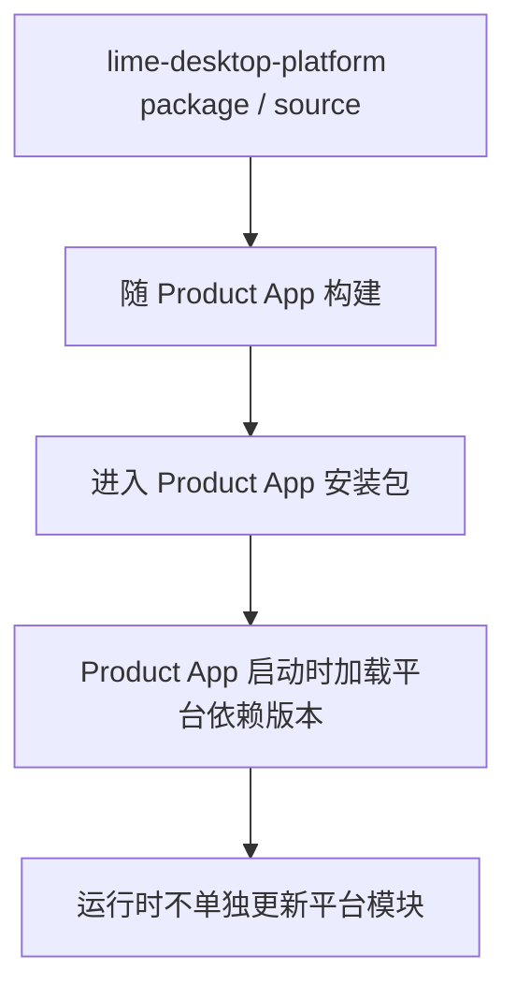
```mermaid
flowchart TD
  PlatformPkg[lime-desktop-platform package / source] --> Build[随 Product App 构建]
  Build --> Bundle[进入 Product App 安装包]
  Bundle --> Runtime[Product App 启动时加载平台依赖版本]
  Runtime --> NoRuntimeInstall[运行时不单独更新平台模块]
```

说明：

- Product App 自身更新由产品安装器、Electron updater、Tauri updater 或系统包管理器负责；平台底座只提供 release metadata 投影、更新状态和导航入口，不写 `agentapp` 安装表。
- `agentapp package` 的安装、更新、禁用和卸载由 Host Runtime 管理，写入的是 package installed catalog，并触发 projection / readiness 重算。
- `lime-desktop-platform` 在 v1 作为 Product App 的依赖和宿主模块随应用构建发布，不设计运行时“单独更新平台模块”的安装表。
- 停止 reference runtime 子进程只属于 smoke / reference fixture，不是正式 Product App 更新或卸载模型。

## 12. Reference Fixture 流程图

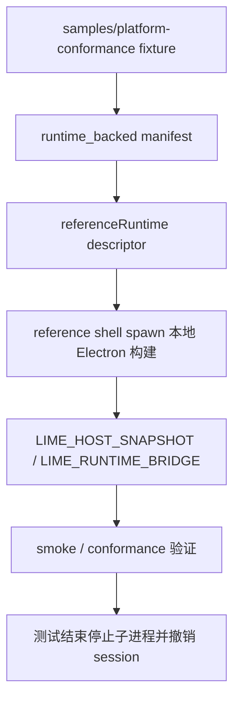
```mermaid
flowchart TD
  Fixture[samples/platform-conformance fixture] --> Manifest[runtime_backed manifest]
  Manifest --> RefRuntime[referenceRuntime descriptor]
  RefRuntime --> Launch[reference shell spawn 本地 Electron 构建]
  Launch --> Env[LIME_HOST_SNAPSHOT / LIME_RUNTIME_BRIDGE]
  Env --> Smoke[smoke / conformance 验证]
  Smoke --> Stop[测试结束停止子进程并撤销 session]
```

说明：这条路径是 `compat`。它可以保留用于测试，但不能作为 `content-studio`、`zhongcao` 或 OEM App 的生产启动模型。

## 13. 平台变化事件图

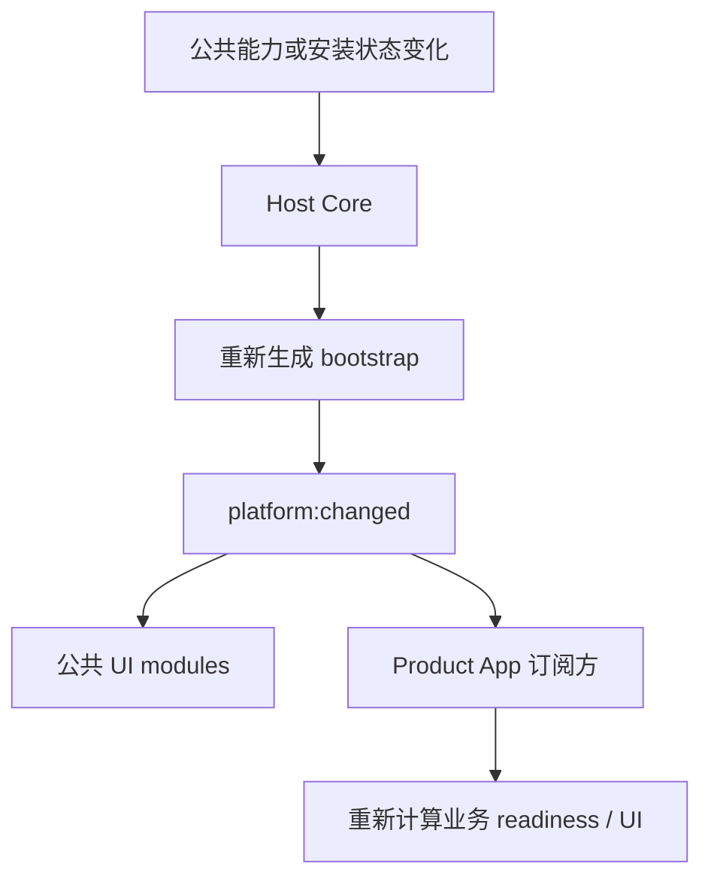
```mermaid
flowchart TD
  Change[公共能力或安装状态变化] --> Core[Host Core]
  Core --> Bootstrap[重新生成 bootstrap]
  Bootstrap --> Event[platform:changed]
  Event --> PlatformUI[公共 UI modules]
  Event --> ProductApp[Product App 订阅方]
  ProductApp --> Recalc[重新计算业务 readiness / UI]
```

## 14. 适配关系图

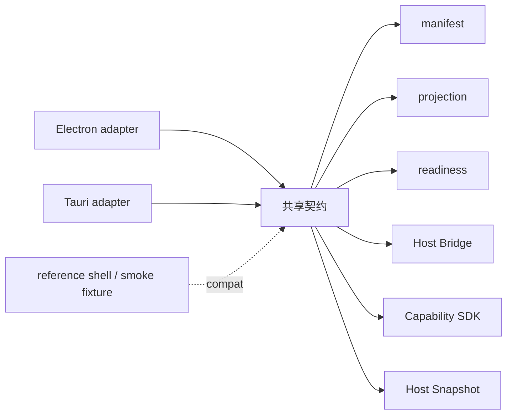
```mermaid
flowchart LR
  Contract[共享契约] --> Manifest[manifest]
  Contract --> Projection[projection]
  Contract --> Readiness[readiness]
  Contract --> Bridge[Host Bridge]
  Contract --> SDK[Capability SDK]
  Contract --> Snapshot[Host Snapshot]

  Electron[Electron adapter] --> Contract
  Tauri[Tauri adapter] --> Contract
  Reference[reference shell / smoke fixture] -. compat .-> Contract
```

## 15. 开发到发布流程图

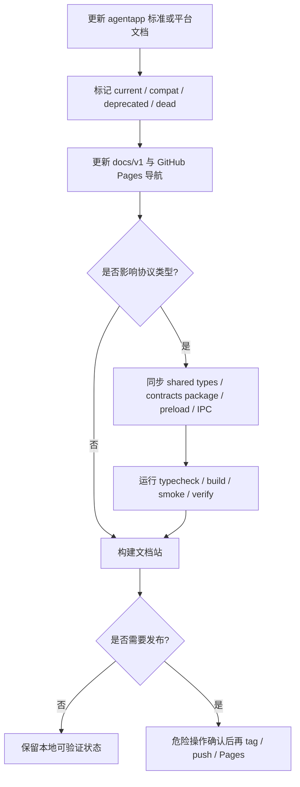
```mermaid
flowchart TD
  Draft[更新 agentapp 标准或平台文档] --> Classify[标记 current / compat / deprecated / dead]
  Classify --> Docs[更新 docs/v1 与 GitHub Pages 导航]
  Docs --> Contracts{是否影响协议类型?}
  Contracts -- 是 --> Types[同步 shared types / contracts package / preload / IPC]
  Contracts -- 否 --> BuildDocs[构建文档站]
  Types --> Verify[运行 typecheck / build / smoke / verify]
  Verify --> BuildDocs
  BuildDocs --> Review{是否需要发布?}
  Review -- 否 --> Done[保留本地可验证状态]
  Review -- 是 --> Confirm[危险操作确认后再 tag / push / Pages]
```

## 16. App Server Agent Runtime 桥接架构

Agent runtime 的 current 事实源已经切换为 Lime App Server JSON-RPC。`lime-desktop-platform` 只承担桌面宿主、Host Bridge、Capability SDK adapter、公共设置和 App Server client 生命周期，不再规划或暴露 Pi agent、Claude SDK backend router 或 Product App 可见 provider SDK。

Product App 通过 `lime.agent` capability 发起 Agent 调用，桌面宿主把请求投影到 App Server JSON-RPC：

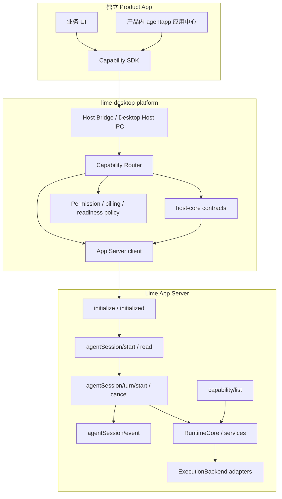
```mermaid
flowchart TB
  subgraph Product[独立 Product App]
    AppUI[业务 UI]
    AgentCenter[产品内 agentapp 应用中心]
    CapSDK[Capability SDK]
  end

  subgraph Platform[lime-desktop-platform]
    HostBridge[Host Bridge / Desktop Host IPC]
    CapRouter[Capability Router]
    HostCore[host-core contracts]
    AppServerClient[App Server client]
    Policy[Permission / billing / readiness policy]
  end

  subgraph AppServer[Lime App Server]
    Initialize[initialize / initialized]
    AgentSession[agentSession/start / read]
    Turn[agentSession/turn/start / cancel]
    Event[agentSession/event]
    Capability[capability/list]
    RuntimeCore[RuntimeCore / services]
    ExecutionBackend[ExecutionBackend adapters]
  end

  AppUI --> CapSDK
  AgentCenter --> CapSDK
  CapSDK --> HostBridge
  HostBridge --> CapRouter
  CapRouter --> HostCore
  CapRouter --> AppServerClient
  HostCore --> AppServerClient
  AppServerClient --> Initialize
  Initialize --> AgentSession
  AgentSession --> Turn
  Turn --> Event
  Turn --> RuntimeCore
  Capability --> RuntimeCore
  RuntimeCore --> ExecutionBackend
  CapRouter --> Policy
```

实现约束：

- `agentRuntime.bridge.kind=app-server-json-rpc` 是 runtime bridge profile 的 current 声明。
- `lime.agent` 是 current capability；`lime.agentExecution` 只允许作为 deprecated compat alias 投影到同一 App Server bridge。
- Product App 只能调用 Capability SDK / Host Bridge，不能直接 spawn sidecar、读取 JSONL transport、调用旧 desktop command、import RuntimeCore 或 provider SDK。
- App Server JSON-RPC 拥有后端 request / response 形状；RuntimeCore 拥有 session、turn、event、artifact、evidence、workspace 和 policy facts。
- 没有真实 App Server client 时必须返回 `blocked` / `needs-setup`，不能回退 mock backend 或 provider SDK 伪成功。

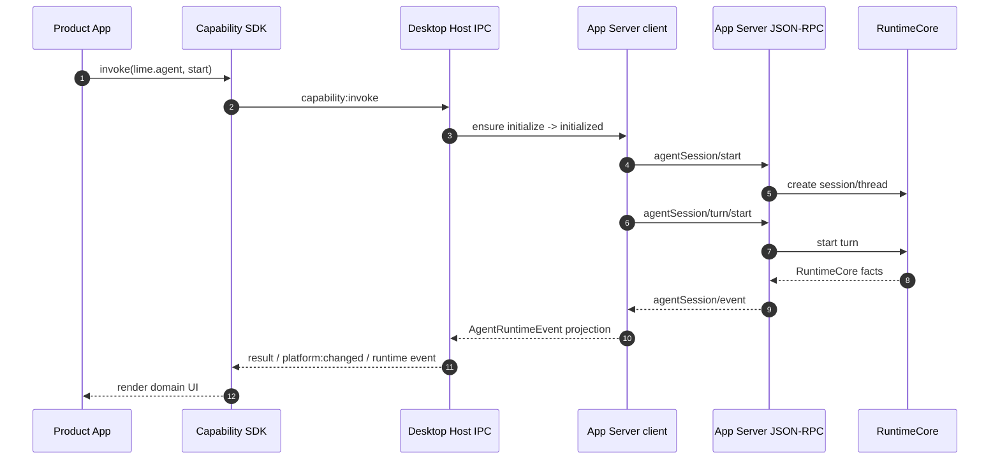
```mermaid
sequenceDiagram
  autonumber
  participant App as Product App
  participant SDK as Capability SDK
  participant Host as Desktop Host IPC
  participant Client as App Server client
  participant Server as App Server JSON-RPC
  participant Core as RuntimeCore

  App->>SDK: invoke(lime.agent, start)
  SDK->>Host: capability:invoke
  Host->>Client: ensure initialize -> initialized
  Client->>Server: agentSession/start
  Server->>Core: create session/thread
  Client->>Server: agentSession/turn/start
  Server->>Core: start turn
  Core-->>Server: RuntimeCore facts
  Server-->>Client: agentSession/event
  Client-->>Host: AgentRuntimeEvent projection
  Host-->>SDK: result / platform:changed / runtime event
  SDK-->>App: render domain UI
```

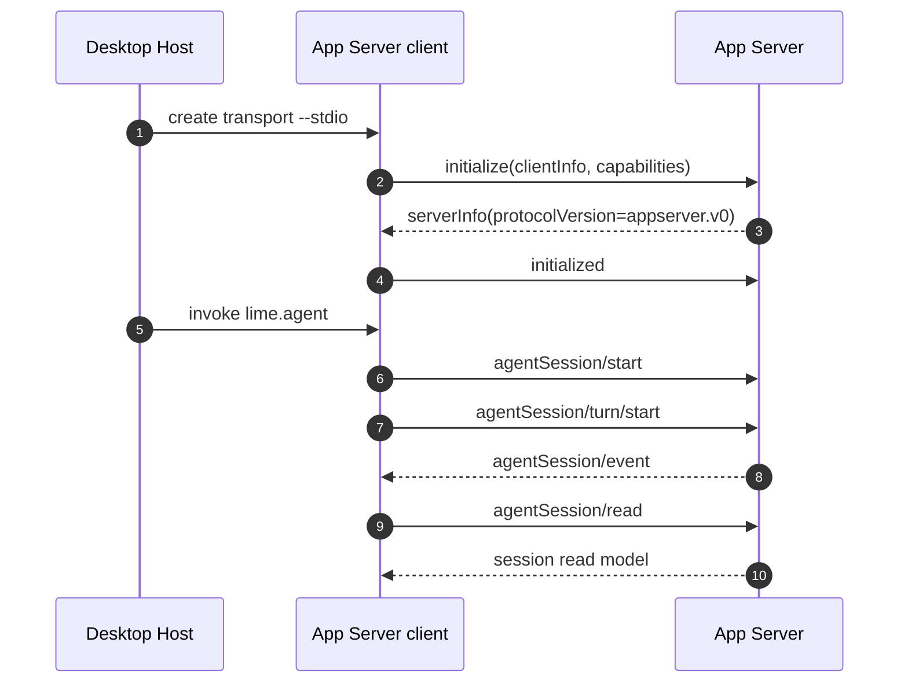
```mermaid
sequenceDiagram
  autonumber
  participant Host as Desktop Host
  participant Client as App Server client
  participant Server as App Server

  Host->>Client: create transport --stdio
  Client->>Server: initialize(clientInfo, capabilities)
  Server-->>Client: serverInfo(protocolVersion=appserver.v0)
  Client->>Server: initialized
  Host->>Client: invoke lime.agent
  Client->>Server: agentSession/start
  Client->>Server: agentSession/turn/start
  Server-->>Client: agentSession/event
  Client->>Server: agentSession/read
  Server-->>Client: session read model
```

当前代码状态：`src/main/services/appServerRuntimeService.ts` 已提供 bridge profile、请求归一化、diagnostics、非敏感 `runtimeContext` 和 fail-closed `blocked` 结果；`src/main/services/appServerJsonRpcClient.ts` 已提供 JSON-RPC line transport、`initialize -> initialized -> agentSession/start -> agentSession/turn/start -> agentSession/event` 投影和配置化 stdio sidecar lifecycle。未配置 `APP_SERVER_BIN` 或连接失败时仍 fail closed；开发态 live sidecar smoke 已覆盖 `initialize`、`capability/list`、`agentSession/start` 和 `agentSession/turn/start` 到 RuntimeCore backend 边界。packaged resources manifest 解析、sha256 校验、相对路径约束和 mock backend 阻断已有单测；packaged-resource staging smoke 已从临时 resources manifest 启动真实 App Server；external fixture event-stream smoke 已验证 `message.delta` / `turn.completed` 经 `agentSession/event` 推到客户端，并通过 `agentSession/read` 读回同一 session 的 turn 和用户消息 read model；`smoke:app-server-sidecar:package-resources` 可验证现有 Electron resources / package dir 的资源形状和真实 stdio 启动，但真实 Electron packaged artifact smoke、真实 provider / RuntimeBackend live streaming 和生产级 credential injection 仍未完成。

## 17. 治理分类

- `current`：`agentapp` 标准、`lime-desktop-platform` contracts / host-core / UI modules / Electron adapter / Tauri adapter、Host Snapshot、Capability SDK、`PlatformNavigationIntent`、`lime.agent` capability、`agentRuntime.bridge.kind=app-server-json-rpc`、App Server JSON-RPC method mapping、最小 App Server JSON-RPC client / stdio sidecar lifecycle、Product App 独立运行并消费平台能力、Product App 产品内 Agent App package。
- `current target`：Electron packaged artifact App Server sidecar smoke、真实 provider / RuntimeBackend live streaming、ExecutionBackend facts、生产级 credential injection。
- `deprecated`：`lime.agentExecution` capability 名称、Product App 内私有模型设置、OAuth、充值、OEM、更新、平台安装表、重复应用中心协议。
- `compat`：`samples/platform-conformance`、`referenceRuntime`、`LIME_HOST_SNAPSHOT`、`LIME_RUNTIME_BRIDGE`、runtime-backed reference shell、单文件 catalog fallback。
- `dead`：把 `zhongcao`、`content-studio` 或 OEM App 当成 `lime-desktop-platform` 核心产品对象或子 App；把真实 Product App 名称作为平台内置同名 App 进入运行时 catalog；生产路径由平台应用中心托管启动 Product App 子进程；把 `lime-desktop-platform` 当作 Agent App 标准事实源；`src/main/services/agentExecution/**` 旧 backend router 文件；Pi agent / Claude SDK backend router 作为平台 current 或 proposed runtime 方向；业务页面直接 import provider SDK。
