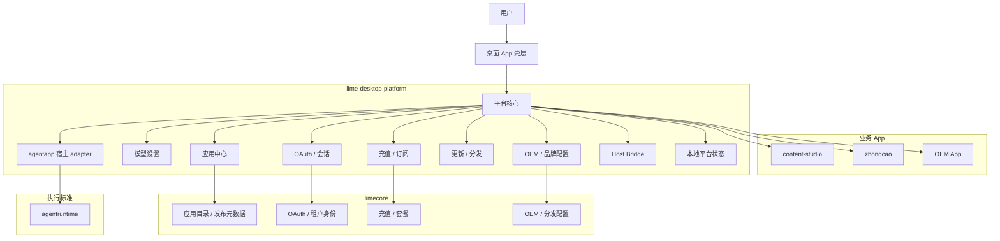
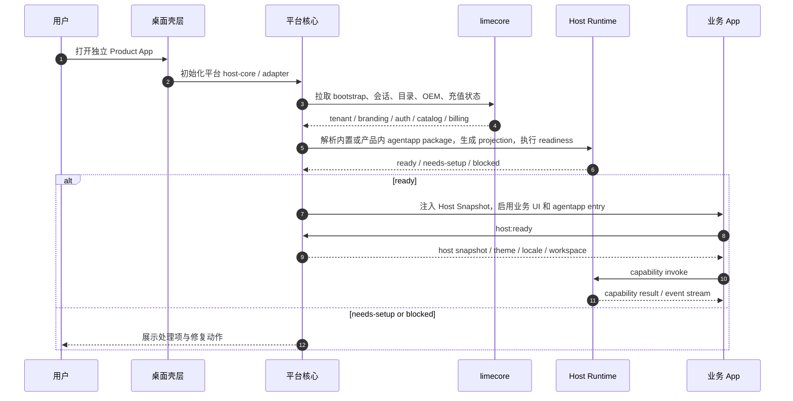
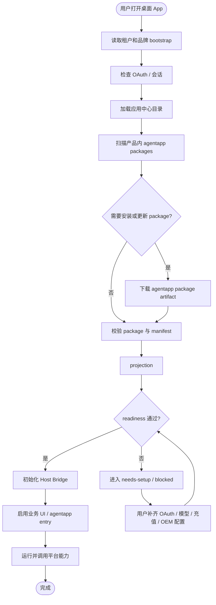

# Lime Desktop Platform v1 PRD

## 1. 背景

Lime 组织已经进入多桌面 App 并行阶段，`content-studio`、`zhongcao` 以及后续 OEM App 都会复用同一批基础能力。这些 Product App 都在各自仓库和安装包里独立运行，不是平台 App 的子 App。平台仓库只保留中性 `samples/platform-conformance` fixture，用来验证平台宿主协议和公共能力复用。

当前最需要抽离的不是某一个业务页面，而是桌面产品线的公共底座：

- Agent App 宿主运行时
- 模型设置与生效策略
- OAuth 与租户会话
- OEM 品牌与分发配置
- 充值、订阅与余额展示
- 应用中心、安装、更新、启用、禁用
- 公共 UI modules，用于平台能力总览、应用中心、云端会话、模型设置、品牌、充值、更新、运行、Host Bridge 和诊断

如果这些能力继续散落在单个 App 里，后续每新增一个桌面产品，就会重新复制登录、设置、发布、更新、计费和应用管理逻辑。

## 2. 产品定义

`lime-desktop-platform` 是 Lime 组织下的独立桌面平台底座仓库。

它的职责不是再做一个业务 App，而是统一承接所有桌面 App 共享的宿主能力，并给业务 App 提供稳定的运行与接入面。

### 2.1 核心定位

- 平台底座，不是业务壳。
- 桌面优先，不是通用 Web 平台。
- Electron 优先，但协议必须兼容未来 Tauri + React + Rust。
- 统一租户级能力，不让每个 App 自己做一套登录、模型设置和计费。

### 2.2 首批接入对象与示例

- `content-studio`
- 后续所有 OEM 桌面 App
- `zhongcao`
- `samples/platform-conformance` 中性 reference fixture，用于验证平台协议，不代表任何真实 Product App

## 3. 目标与非目标

### 3.1 目标

- 建立一套可复用的桌面平台底座。
- 让多个 Electron App 共用同一套 Agent App 宿主能力。
- 让模型设置、OAuth、OEM、充值、应用中心成为平台能力，而不是业务 App 私有实现。
- 让公共 UI modules 成为唯一页面事实源，Product App 只挂载模块，不重写登录、模型、充值、品牌、更新和诊断页面。
- 为后续 Tauri + Rust 适配预留稳定协议边界。
- 保持业务 App 只关心自己的内容流、领域数据和 UI。

### 3.2 非目标

- 不在 v1 里重写所有业务 App。
- 不在 v1 里把云端控制面搬到桌面端。
- 不在 v1 里做移动端或通用 Web 平台。
- 不在 v1 里实现完整 Rust 运行时，只做协议兼容。
- 不在 v1 里引入跨租户共享数据或插件任意执行。

## 4. 范围

### 4.1 平台公共能力

| 模块 | 平台职责 | 业务 App 不负责 |
| --- | --- | --- |
| agentapp 宿主 adapter | Agent App 安装、校验、投影、readiness、Host Bridge、能力路由 | 自己实现宿主协议 |
| Agent App 应用中心 | 拉取目录、展示状态、安装、更新、启用、禁用 | 自己维护第二套应用目录协议 |
| 模型设置 | 统一模型与 provider 配置、有效配置解析、同步到宿主 | 自己拼接模型配置页 |
| OAuth / 会话 | 租户登录、会话管理、token 注入、退出 | 每个 App 单独登录 |
| OEM / 品牌 | app 名称、logo、主题、渠道、壳层文案、分发参数 | 业务层硬编码品牌 |
| 充值 / 订阅 | 余额、套餐、开通、续费、支付入口、状态展示 | 自己做账本与支付逻辑 |
| 更新 / 分发 | 检查更新、下载、安装、版本切换、回滚提示 | 自己维护发布逻辑 |
| 平台设置 | 工作区、代理、语言、主题、默认能力开关 | 各 App 重复维护设置页 |
| 公共 UI modules | 平台能力总览、应用中心、云端会话、模型设置、品牌、充值、更新、运行、Host Bridge、诊断 | 各 App 复制公共页面 |

### 4.2 与现有系统的边界

| 系统 | 负责什么 | 不负责什么 |
| --- | --- | --- |
| `agentruntime` | 任务、事件、工具、权限、artifact、evidence 等执行事实标准 | 桌面壳、品牌、登录、计费 |
| `limecore` | 云端控制面、租户、OAuth 授权、应用目录、发布元数据、充值后端 | 本地宿主渲染和 App 安装执行 |
| `lime-desktop-platform` | 本地宿主、`agentapp` 标准应用中心、projection、readiness、Host Bridge、Capability SDK adapter、模型设置、OEM 壳层、会话、桥接、平台配置 | Agent App 标准本身和业务工作流本身 |
| 业务 App | 领域流程、页面、素材、知识、内容和专用交互 | 统一登录、模型、计费、宿主协议 |

公共能力只在平台层实现。业务 App 可以有自己的产品内 Agent App 应用中心，但模型设置、OAuth、充值 / 订阅、OEM、更新、平台级应用中心和安装表只能由 `lime-desktop-platform` 或同协议宿主提供，业务 App 通过 Host Snapshot、Capability SDK 和 `PlatformNavigationIntent` 消费。公共页面也同样只由平台提供：现阶段代码事实源是 `src/renderer/src/platformModules.tsx`，reference shell 只装配它；后续应拆成 `@limecloud/desktop-platform-react` 或同等 workspace package。

### 4.4 公共 UI Modules 范围

v1 公共 UI modules 至少包含：

- `PlatformOverviewModule`：平台能力总览。
- `PlatformAppCenterModule`：平台级 agentapp package 应用中心。
- `CloudSessionModule`：OAuth / 租户会话。
- `ModelSettingsModule`：模型 provider、默认模型和凭证配置状态。
- `BrandingModule`：OEM / 品牌投影。
- `BillingModule`：充值 / 订阅投影。
- `UpdatesModule`：agentapp package 更新与三条生命周期边界。
- `RuntimeModule`：Host Snapshot、capability invoke 和 agent execution runtime。
- `HostBridgeModule`：Host Bridge 协议诊断。
- `DiagnosticsModule`：projection、readiness、control plane 和事件诊断。

Product App 的接入方式是“挂载模块 + 传入 action handlers”，不是复制页面代码。`zhongcao` 的平台模块页只是示例挂载入口，不能成为公共设置页事实源。

### 4.3 建议仓库与包名

> 这里是建议命名，不是最终实现约束。

- 仓库：`lime-desktop-platform`
- 核心宿主包：`@limecloud/agent-app-host-runtime`
- 平台适配层：Electron first，后续增加 Tauri 适配层

## 5. 核心体验

### 5.1 首次启动

用户首次打开任一桌面 App 时，平台应先完成：

1. 读取租户与品牌 bootstrap。
2. 拉取当前 OAuth 与会话状态。
3. 初始化模型设置和默认能力配置。
4. 加载 agentapp 应用中心目录与本地 package 安装状态。
5. 进入平台壳层首页或业务入口。

### 5.2 应用中心

应用中心是桌面平台的第一层业务门面，管理的是 `agentapp package`，不是 Product App 安装包本身。它包含：

- 云端 package 列表
- 本地已安装 package
- 可安装 package
- 需要处理的应用
- 应用详情、版本、来源、状态、说明
- 安装、更新、启用、禁用、启动

应用中心必须清楚区分：

- 云端来源
- 本地来源
- 需要授权
- 需要补齐配置
- 已阻断

### 5.3 Agent App Package 安装与启动

平台在打开 agentapp entry 或允许 capability 调用之前必须完成：

- 包校验
- manifest 解析
- projection
- readiness
- capability 绑定
- Host Bridge 初始化

Product App 启动后只能通过宿主桥接调用平台能力，不能直接访问宿主内部实现；agentapp package 也只能通过 Host Bridge / Capability SDK 进入平台能力。

### 5.4 模型设置

模型设置是平台共享设置，不是某个 App 的局部配置。

v1 需要支持：

- 文本模型配置
- 图片模型配置
- 视频模型配置
- provider / protocol 选择
- 默认值与 App 覆盖值的解析
- 将解析后的有效配置注入给运行中的 App

### 5.5 OAuth / OEM / 充值

这三类能力都属于平台级租户能力。

- OAuth 负责身份与会话
- OEM 负责品牌与分发
- 充值负责余额、订阅和付费状态

桌面端只维护交互和状态投影，权威数据仍以 `limecore` 的云端控制面为准。

## 6. 架构边界

### 6.1 分层原则

- `agentruntime` 负责执行事实，不负责桌面 UI。
- `limecore` 负责云端控制面，不负责本地宿主渲染。
- `lime-desktop-platform` 负责桌面公共底座，不负责业务内容创作逻辑。
- 业务 App 只做自己的领域流程，不复制平台能力。

### 6.2 统一协议

v1 必须先统一协议，再统一实现。

最低需要稳定的协议面：

- App 发现与安装
- readiness / blocked / needs-setup
- Host Bridge v1
- capability invoke
- host snapshot
- theme / locale / workspace 注入

### 6.3 桌面实现优先级

1. Electron + React + TypeScript
2. 同协议 Tauri + React + Rust
3. 其他宿主仅在协议兼容前提下接入

### 6.4 架构图

### 6.5 时序图

### 6.6 流程图

## 7. 里程碑

### M1: 平台骨架

- 创建 `lime-desktop-platform` 仓库
- 建立基础目录与文档结构
- 定义平台边界、角色和模块命名
- 定义 Host Runtime 与 App 的协议边界

### M2: 桌面底座

- 接入应用中心
- 接入模型设置
- 接入 OAuth 与会话
- 接入 OEM 壳层与品牌切换
- 接入充值 / 订阅展示

### M3: 多 Product App 复用

- `content-studio` 作为独立 Agent App / Product App 消费平台底座
- `zhongcao` 作为独立 Product App 消费平台底座
- `samples/platform-conformance` 作为中性 fixture 验证宿主投影、Capability SDK 和 `PlatformNavigationIntent`
- 形成通用 `agentapp` manifest、install mode、projection、readiness、Host Snapshot、Capability SDK、更新投影和设置路径

### M4: 跨技术栈兼容

- 抽出可复用 Host Runtime 协议
- 提供 Tauri 适配方案
- 保持业务 App 不感知宿主实现差异

## 8. 验收标准

v1 通过的标准不是“页面做完”，而是“平台能力可以被多个 App 复用”。

必须满足以下条件：

- 新 App 可以在不复制登录和模型设置代码的情况下接入平台。
- `content-studio`、`zhongcao`、后续 OEM App 和平台级应用中心可以共用同一套 `agentapp` 标准协议、会话、模型设置、billing、OEM 和更新投影；Product App 内可以有自己的应用中心实现。
- App 安装、启动、更新都经过 projection 和 readiness。
- blocked 状态可以被用户看见，不会伪造成成功。
- 充值、OAuth、OEM 配置以租户级方式管理，App 只消费结果。
- Host Bridge 协议可以被 Electron 实现，也可以被后续 Tauri 实现复用。

## 9. 风险与约束

- 最大风险是把平台又做成一个新的业务 App。
- 第二个风险是把 `agentruntime` 和桌面宿主 runtime 混成一个概念。
- 第三个风险是先做 UI，后补协议，最后导致未来 Tauri 无法复用。
- 第四个风险是把 OAuth、OEM、充值拆成 App 私有逻辑，重新制造重复代码。

## 10. 默认决策

本 PRD 默认采用以下结论：

- `lime-desktop-platform` 为独立仓库。
- 平台底座是整个 App 线的基础。
- `content-studio` 和后续 OEM App 都是独立 Agent App / Product App 消费者，不是平台子 App；其应用中心协议事实源是 `agentapp`。
- `samples/platform-conformance` 是中性 reference fixture，用于证明上述边界，不是平台核心产品对象。
- 平台 App 运行时 catalog 不内置 `zhongcao`、`content-studio` 或 OEM App 的同名样板。
- Electron 先行，Tauri 通过同协议适配。
- OAuth、OEM、充值、模型设置都按租户平台级设计。
- `limecore` 继续保留云端控制面职责，不吞桌面实现细节。

## 11. 文档索引

- [README](./README.md)
- [平台能力边界](./platform-capabilities.md)
- [Host 与数据契约](./host-contracts.md)
- [架构与流程图](./architecture-diagrams.md)
- [工作流模型](./workflow-model.md)
- [UI 蓝图](./ui-blueprint.md)
- [实施计划](./implementation-plan.md)
- [平台方法论](./platform-methodology.md)
- [宿主运行手册](./host-runtime-playbook.md)

## 12. 典型用户故事

| 角色 | 用户故事 | 入口 | 验收 |
| --- | --- | --- | --- |
| 普通用户 | 我想打开已经安装的 App 并直接进入工作。 | 应用中心 / 最近使用 | 能看到 App，能启动，能回到运行页。 |
| App 管理员 | 我想安装一个新的 App 并看到它是否可启动。 | 应用中心 | 能安装、投影、判断 readiness。 |
| 平台管理员 | 我想统一配置模型、OAuth、OEM 和 billing。 | 设置中心 | 配置能影响所有接入 App。 |
| OEM 运营 | 我想切换品牌和渠道外观。 | OEM 设置页 | 壳层品牌投影能立即生效。 |
| 开发者 | 我想看 manifest、projection 和 bridge 日志。 | 开发者页 | 能定位 blocked 或 setup 问题。 |
| QA / 验收 | 我想验证两个 App 能复用同一套底座。 | 应用中心 / 运行页 | 不复制登录和设置逻辑也能接入。 |

## 13. 一期交付物

- 平台壳层
- 应用中心
- 设置中心
- 开发者诊断页
- manifest / projection / readiness / bridge 契约
- OAuth / 模型 / OEM / billing 的统一投影
- `content-studio` / `zhongcao` 接入文档
- `agentapp` 标准宿主 adapter 样板

## 14. 开发顺序

1. 先落 `src/shared/types.ts` 和契约文档。
2. 再落桌面壳层和导航。
3. 再落应用中心和设置中心。
4. 再落 Host Runtime 和 Host Bridge。
5. 再接 `content-studio` 和 `zhongcao` 独立 Product App 消费文档。
6. 再用 `samples/platform-conformance` 中性 fixture 验证 `agentapp` 标准和宿主 capability。
7. 最后做 Tauri 同协议复用。
