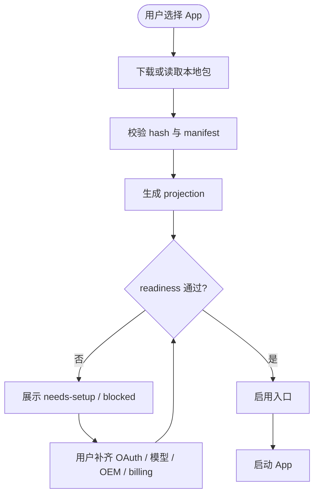
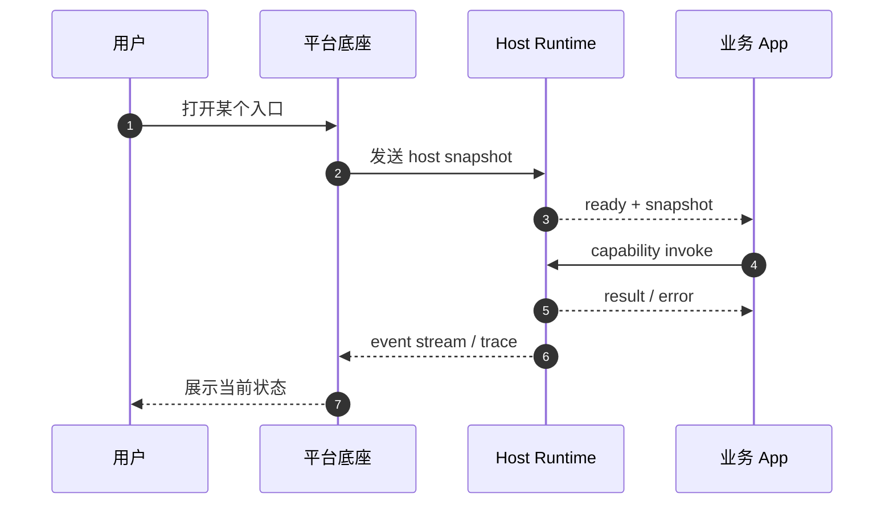
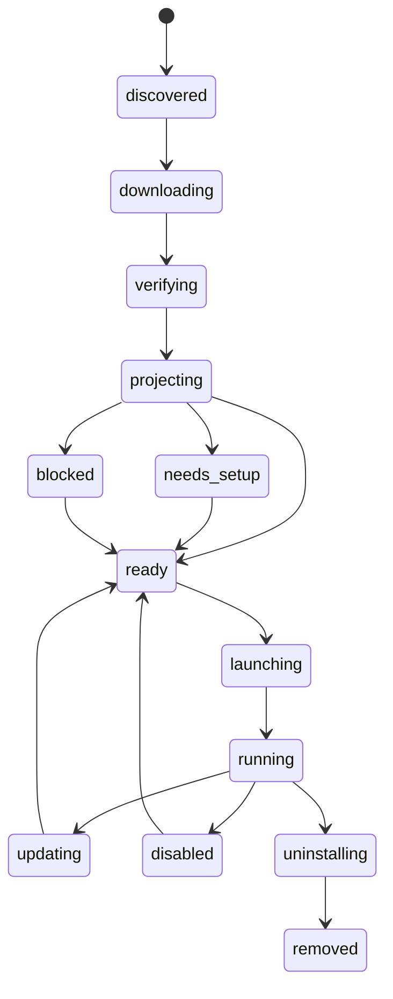

# 工作流模型

## 1. 设计结论

桌面平台最重要的工作流不是业务内容流，而是 App 生命周期流：发现、安装、投影、readiness、激活、运行、更新、禁用和卸载。

## 2. App 生命周期状态

```text
discovered
  -> downloading
  -> downloaded
  -> projecting
  -> needs-setup / blocked / disabled / ready
  -> launching
  -> running
  -> updating
  -> disabled
  -> uninstalling
  -> removed
```

### 状态说明

| 状态 | 含义 | 用户动作 |
| --- | --- | --- |
| `discovered` | 发现了应用，但尚未安装。 | 安装。 |
| `downloading` | 正在下载包。 | 等待。 |
| `projecting` | 正在生成 catalog / entry / readiness。 | 等待。 |
| `needs-setup` | 可修复，缺 OAuth / 模型 / OEM / billing 等设置。 | 补齐设置。 |
| `blocked` | 缺关键能力或不兼容。 | 先处理阻断。 |
| `ready` | 可启动。 | 打开应用。 |
| `launching` | 正在启动 UI bundle。 | 等待。 |
| `running` | 正在使用。 | 继续工作。 |
| `updating` | 正在升级版本。 | 等待。 |
| `disabled` | 入口被隐藏或暂停。 | 启用。 |
| `uninstalling` | 正在卸载。 | 等待。 |
| `removed` | 已移除。 | 重新安装。 |

## 3. 安装工作流



## 4. 运行工作流



## 5. 设置同步工作流

### 5.1 模型设置

- 本地保存用户选择。
- 云端只给默认值和品牌推荐。
- App 运行时只读有效配置，不直接改平台全局配置。

### 5.2 OAuth

- 启动时先读本地会话。
- 无会话则进入登录页。
- 登录成功后同步租户身份和授权状态。

### 5.3 OEM

- 先读取品牌 bootstrap。
- 再应用壳层主题、logo 和文案。
- 品牌切换要触发 UI 刷新，但不重建业务数据。

### 5.4 充值

- 只展示租户级状态。
- 不在本地维护账本真相。
- 余额低或未开通时必须显示 `needs-payment` 或等价状态。

## 6. 应用更新工作流

- 先检查云端 release。
- 再比较本地 identity。
- 再决定下载、升级、回滚或保持当前版本。
- 更新过程中不得丢失本地设置、会话和工作区事实。

## 7. 失败模型

| 失败类型 | 处理方式 |
| --- | --- |
| hash 不一致 | 阻断安装。 |
| manifest 不兼容 | 阻断启动。 |
| 缺必需 capability | 展示 blocked。 |
| OAuth 失效 | 回到登录。 |
| billing 未开通 | 展示需要处理。 |
| OEM 配置缺失 | 展示品牌修复。 |
| 更新失败 | 保留旧版本并提示重试。 |

## 8. App 生命周期状态机



说明：

- `discovered` 表示已发现但尚未安装。
- `verifying` 表示包校验和 manifest 校验。
- `projecting` 表示宿主生成可读投影。
- `needs_setup` 表示缺 OAuth、模型、OEM 或 billing 等可修复配置。
- `blocked` 表示能力缺失或不兼容，必须显式告诉用户原因。
- `ready` 才能进入启动。

## 9. 状态写入规则

- 安装状态只能由 Host Runtime 写入。
- 模型设置只能由设置中心写入，本地快照只读。
- OAuth 会话只能由认证流程写入，业务 App 不得伪造。
- OEM 和 billing 只能投影，不允许业务 App 反写。
- 运行页只读状态，不反向决定真相。

## 10. 失败和恢复

| 场景 | 进入状态 | 恢复动作 |
| --- | --- | --- |
| 缺模型 provider | `needs-setup` | 去设置中心补配置。 |
| 会话失效 | `unauthenticated` | 重新登录。 |
| 包校验失败 | `blocked` | 重新下载或替换包。 |
| 品牌配置缺失 | `needs-setup` | 补齐 OEM bootstrap。 |
| billing 不可用 | `needs-setup` | 补齐套餐或确认状态。 |
| 更新失败 | `blocked` 或 `ready` 回退 | 保留旧版本并重试。 |
