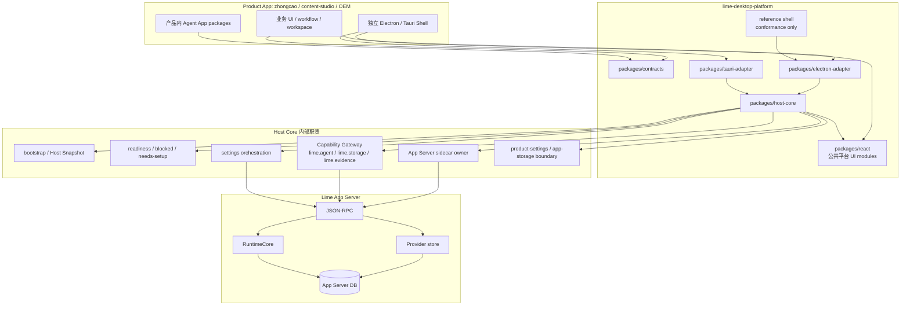
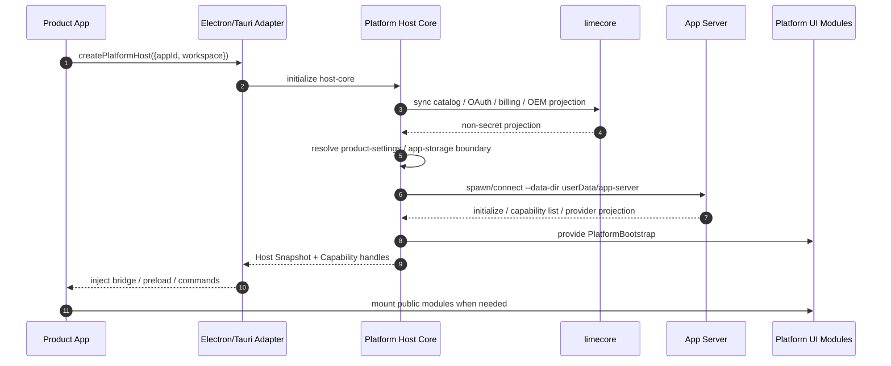
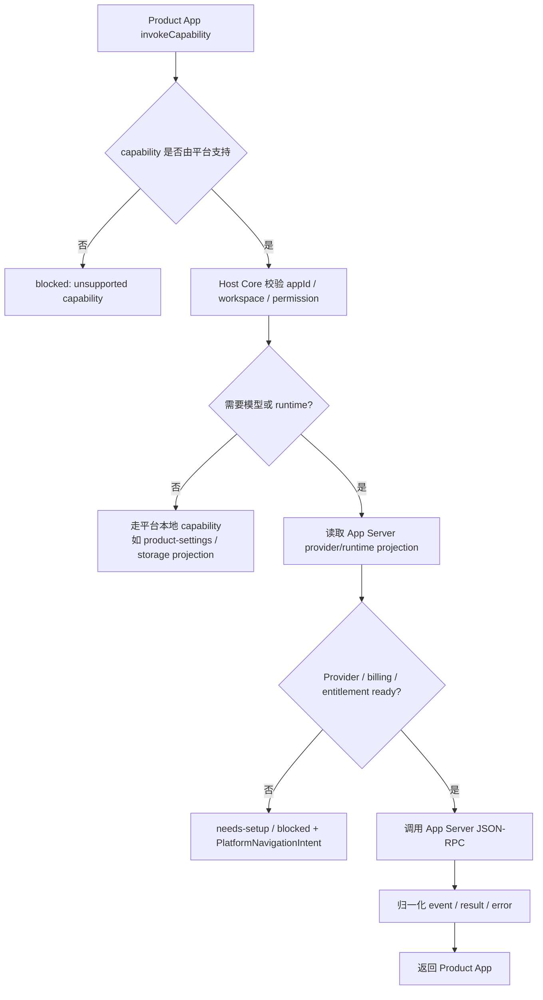
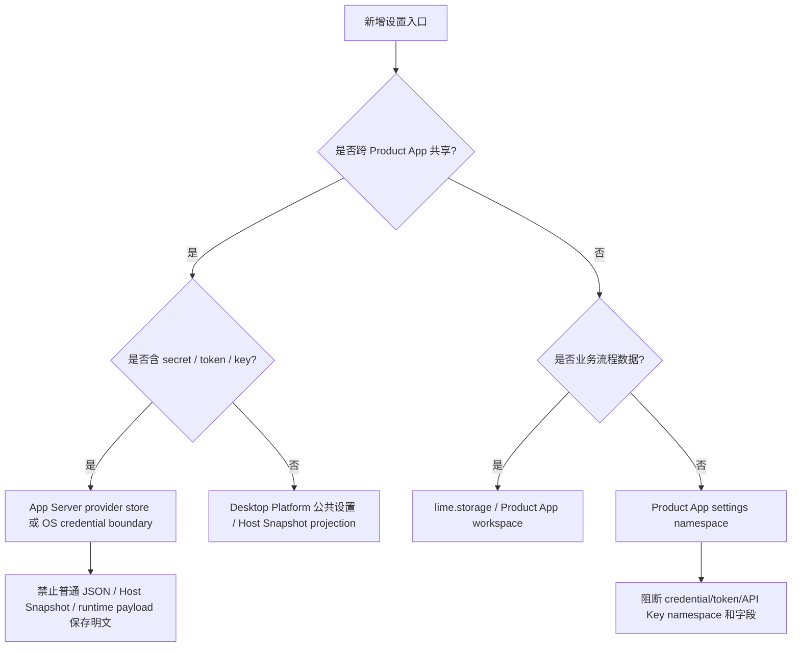

# Desktop Platform Host Kit 边界决策 PRD

## 1. 背景

`lime-desktop-platform` 原计划承接应用中心、设置、Provider 设置、OAuth、billing、更新、Host Bridge 和 Agent Runtime 接入。现在 Agent Runtime 主线已切到 Lime App Server JSON-RPC，Provider metadata / API Key 也应收敛到 App Server provider store。

因此平台必须重新明确定位：它不是第二个 runtime，也不是把 `zhongcao` 托管成子 App 的大壳。它是 Product App 可复用的桌面 Host Kit 和公共平台 UX。

## 2. 结论

`lime-desktop-platform` 不多余，但边界必须收窄为：

- 公共设置和平台模块 UI。
- 应用中心和 `agentapp` package projection / readiness。
- Host Snapshot、Host Bridge、Capability Gateway。
- App Server sidecar 生命周期和数据根 owner。
- Electron / Tauri adapter。
- Product App 独特设置托管和业务存储隔离边界。

它不拥有：

- Agent Runtime 执行事实。
- Provider key 持久化事实。
- OAuth / billing 云端权威事实。
- Product App 业务 workflow 和业务 DB schema。

## 3. 目标包结构

```text
lime-desktop-platform
  packages/contracts
    公开类型、schema、capability id、Host Snapshot DTO
  packages/host-core
    bootstrap、readiness、capability gateway、App Server bridge orchestration
  packages/react
    公共 UI modules：应用中心、设置、模型、账号、充值、更新、诊断
  packages/electron-adapter
    Electron main / preload / IPC / sidecar lifecycle
  packages/tauri-adapter
    后续 Tauri commands / plugin bridge
  apps/reference-shell
    conformance、smoke、docs preview；不是生产 Product App 宿主
```

## 4. 架构图



## 5. Product App 启动时序图



## 6. Capability Invoke 流程图



## 7. 设置归属流程图



## 8. Desktop Platform 项目需要怎么做

### P0: 把 reference shell 降级为 conformance

任务：

- 文档中明确 reference shell 只用于 smoke、conformance、docs preview。
- 平台运行时 catalog 只允许中性 `platform-conformance` fixture。
- 不把 `zhongcao` / `content-studio` 当平台内置同名子 App。

验收：

- Product App 被描述为平台包消费者，而不是平台子进程。

### P1: Host Core 成为平台业务编排中心

任务：

- `PlatformService` 中可复用逻辑逐步迁入 `packages/host-core`。
- Electron adapter 只负责 IPC、preload、sidecar lifecycle、OS integration。
- React UI modules 只消费 `PlatformBootstrap` 和 action handlers。

验收：

- `zhongcao` 能在自己的壳内通过 host-core + adapter 使用同一套平台模块。

### P2: App Server projection first

任务：

- Provider 列表、key configured 状态、runtime readiness 优先来自 App Server JSON-RPC。
- App Server 未连接时 fail closed。
- 普通 JSON 只保留 UI 偏好和非敏感 projection。

验收：

- Desktop Platform 不再把本地模型 JSON 当 Provider 事实源。

### P3: 公共设置与业务设置分层

任务：

- 公共设置进入平台设置模块。
- Product App 独特设置进入 `product-settings` namespace。
- 业务草稿、workflow 状态和记录进入 `lime.storage` / workspace 后端。
- 凭证类 namespace / key / value 全部阻断。

验收：

- 新业务 App 不需要复制平台设置页，也不能把 `product-settings` 当业务 DB。

### P4: Capability Gateway 收口

任务：

- `lime.agent` 只委托 App Server JSON-RPC。
- `lime.agentExecution` 只保留 compat alias，并有退出条件。
- Pi agent / Claude SDK backend 不再作为 current/proposed 路线。

验收：

- Product App 调 Agent 能力只有一条 current 主链。

### P5: 守卫与验证

任务：

- `governance:hardcode-scan` 继续阻止 Pi / Claude / 旧 agentExecution backend 回流。
- 单测覆盖 Host Snapshot secret redaction。
- 单测覆盖 sidecar `--data-dir` 注入和 Provider projection。

验收：

- `npm run test:unit`、`npm run typecheck`、`npm run governance:hardcode-scan` 可证明边界。

## 9. 如果未来判断平台多余怎么办

只有两种条件下可以删除或合并 `lime-desktop-platform`：

1. 放弃独立 Product App 路线，所有业务都回到 Lime Desktop 大壳。
2. 明确接受每个 Product App 自己实现 OAuth、Provider 设置、billing、更新和 Host Bridge。

当前架构目标与这两条都冲突。因此本阶段不删除平台，而是收窄平台。

## 10. 治理分类

- `current`：contracts、host-core、公共 React modules、Electron/Tauri adapter、App Server sidecar owner、Capability Gateway。
- `current`：App Server provider store / runtime DB 作为 runtime 和 secret 事实源。
- `compat`：reference shell、dev projection、旧 `lime.agentExecution` alias。
- `compat`：旧 `CredentialBroker` 只作为 Provider key 一次性迁移 source，退出条件是迁移 marker 和旧 key 扫描完成。
- `compat`：平台本地 JSON 只作为 App Server Provider projection 的非敏感缓存；读取前由 App Server `modelProvider/list` 刷新。
- `deprecated`：无 migration marker 的旧 CredentialBroker key。
- `dead`：`CredentialBroker` 作为新 Provider key 写入源、Product App 直接访问平台内部 service、Pi agent / Claude SDK backend、平台托管真实 Product App 子进程。

## 11. 与现有 PRD 的关系

- Provider/key/data root 细节见 [provider-store-data-root-prd.md](./provider-store-data-root-prd.md)。
- 本文是平台是否多余和 Host Kit 边界的上层决策。
