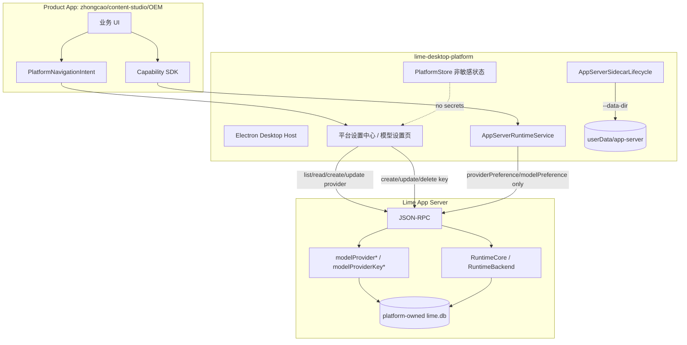
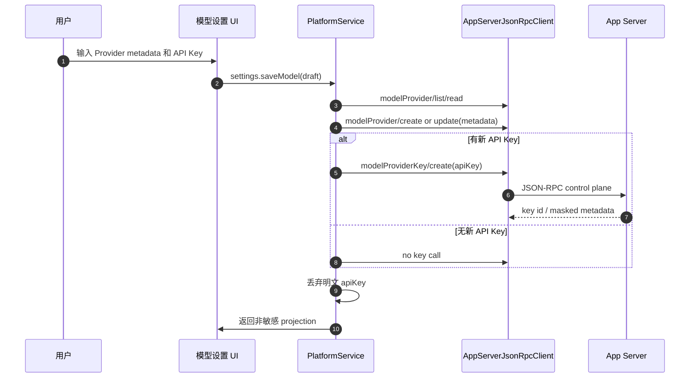
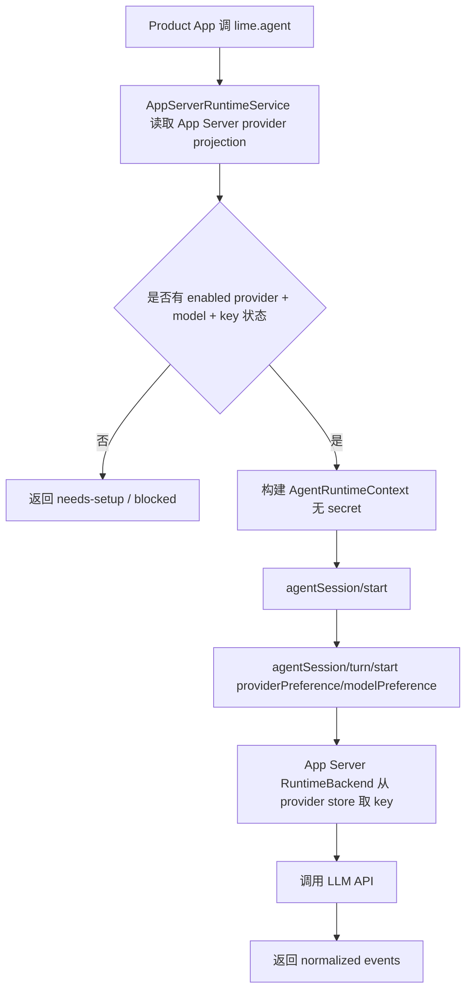

# Desktop Platform Provider Store 与 App Server 数据根升级 PRD

## 1. 背景

`lime-desktop-platform` 的定位是 `zhongcao` 等独立 Product App 的应用中心、设置中心、Host Bridge、Capability Gateway 和 App Server sidecar owner。平台模型设置必须能让 App Server runtime 调用后端 LLM API，同时不能让 Product App 接触 Provider API Key。

当前实现已完成 App Server JSON-RPC 接入、provider/key provisioning、sidecar data root 注入，以及新 API Key 去双写。模型 key 的新写入事实源已经收敛为 App Server provider store：

- 设置页输入的 API Key 只作为 `settings.saveModel` 的瞬时字段。
- Desktop 保存设置时调用 App Server `modelProviderKey/create` 写入 key。
- Desktop `CredentialBroker` 只保留为旧凭证迁移源或诊断状态，不再接收新 key 写入。

目标架构要求 key 只持久化在 App Server provider store。Desktop Platform 只保存非敏感 UI 偏好、App Server sidecar 数据根配置、Provider projection 和 readiness。

## 2. 产品目标

- 平台模型设置页是所有 Product App 共享的唯一模型设置 UI。
- 用户在平台设置中配置 Provider 后，`zhongcao` 等 App 立即可通过 `lime.agent` 使用模型能力。
- API Key 不进入 Product App、不进入 Host Snapshot、不进入 runtime payload、不进入 Desktop 普通 JSON。
- 新平台首次运行不要求已有 `lime.db`；Desktop Platform 启动 App Server 时创建平台专属 DB。
- 现有 Lime 默认 DB 不被 Desktop Platform sidecar 污染。

## 3. 非目标

- 不在 `zhongcao` 或其他业务 App 中实现模型 Provider 设置页。
- 不在 Desktop Host 中实现第二套 LLM runtime。
- 不让 Desktop Platform 直接读取或写入 Existing Lime 默认 `lime.db`，除非用户明确配置为同一数据根。
- 不恢复 Pi agent / Claude SDK backend。
- 不把 `CredentialBroker` 继续作为模型 key 新写入事实源。

## 4. 目标架构

### 4.1 事实源声明

`lime-desktop-platform` 的模型设置 UI 只是 App Server provider store 的前端。Provider metadata 和 key 的 current 事实源是 App Server JSON-RPC + App Server DB；Desktop Platform 保存的只是非敏感 projection、默认模型偏好和 UI 状态。

### 4.2 架构图



## 5. 数据分层

| 数据 | Desktop Platform 存储 | App Server 存储 | 说明 |
| --- | --- | --- | --- |
| App Server sidecar data root | `userData/state` 或派生配置 | 无 | 默认 `userData/app-server` |
| Provider metadata | 非敏感缓存 / projection 可选 | `api_key_providers` | App Server 为事实源 |
| Provider API Key | 不持久化 | `api_keys` 加密字段 | Desktop 只在提交瞬间传给 `modelProviderKey/create` |
| 默认 provider/model 偏好 | 可保存 provider id / model id | 可后续增加偏好接口 | 不含 secret |
| Product App 独特设置 | `product-settings` | 无 | 禁止凭证类 namespace/key/value |
| 业务 App 数据 | `.lime-desktop/app-storage` 或 app 自有 workspace | 无 | 不保存平台凭证 |

## 6. App Server 数据根策略

Desktop Platform 必须成为 sidecar data root owner。

默认路径：

```text
Electron app.getPath("userData")/
  app-server/
    lime.db
    logs/
    sessions/
    agent-apps/
```

启动参数：

```text
app-server --stdio --backend runtime --data-dir "<userData>/app-server"
```

优先级：

1. 用户 / 测试显式 `APP_SERVER_ARGS` 中提供 `--data-dir`
2. Desktop Platform 默认追加 `--data-dir <userData>/app-server`
3. App Server 未收到 data root 时才使用 Existing Lime 默认路径

注意：第 3 点只用于 Existing Lime 或手工运行 App Server，不是 Desktop Platform 的默认行为。

## 7. 保存 Provider 设置流程



## 8. Runtime 调用流程



## 9. 迁移计划

### P0: 文档和 contract 冻结

状态：已实现。

任务：

- 将本 PRD 作为 Desktop Platform provider/key/data root 升级主计划。
- 与 Lime App Server PRD 对齐 data root 和 provider store 边界。
- 标记 `CredentialBroker` 模型 key 新写入路径为 deprecated。

验收：

- README / docs 可说明 key 不再存两遍的目标架构。

### P1: Sidecar data root

状态：已实现。

任务：

- `resolveAppServerSidecarLaunchConfig` 默认为 packaged / env sidecar 注入 `--data-dir <userData>/app-server`。
- 如果用户已在 `APP_SERVER_ARGS` 显式传 `--data-dir`，不重复注入。
- 单测覆盖参数合并和路径不硬编码。

验收：

- Desktop Platform 启动 sidecar 不写 Existing Lime 默认 DB。

### P2: Provider UI 改为 App Server projection first

状态：已实现。

任务：

- `settings:getModel` / `getBootstrap()` 先调用 App Server `modelProvider/list` 刷新非敏感 projection，再返回模型设置。
- `model-settings.json` 只保留默认 provider/model 偏好、最近选择、UI 展示状态。
- App Server 未连接时 fail closed，设置页显示需要连接 App Server，不用本地 JSON 假成功。

验收：

- Provider 列表与 App Server provider store 一致。
- App Server provider projection 不调用 `modelProviderKey/next`，不读取明文 key。

### P3: 删除新 key 写入 CredentialBroker

状态：已实现。

任务：

- `settings.saveModel` 中 `apiKey` 只作为瞬时字段进入 `modelProviderKey/create`，不进入 `CredentialBroker` 写入路径。
- 成功后不写 `credential-broker/model-providers/*.json`。
- 保留旧 CredentialBroker 读取作为 P4 迁移前的 fallback / migration source。

验收：

- 新增或更新 key 后，本地 CredentialBroker 不产生新模型 key 文件。
- Runtime payload 不包含 `apiKey`。
- App Server sync 成功后，Provider projection 的 `storageKind` 为 `app-server-provider-store`，`runtimeStatus` 为 `app-server-provider-ready`。

### P4: 旧 CredentialBroker 迁移

状态：已实现。

任务：

- 启动时扫描旧 broker provider key。
- 对尚未在 App Server provider store 有 key 的 provider 调 `modelProviderKey/create`。
- 成功后以 `model-provider-app-server-sync.json` 的 `credentialSyncedAt` 作为 migration marker，并立即删除旧 `credential-broker/model-providers/<provider>.json`。
- 后续读取只信任 App Server provider projection 和 sync record，不再把旧 broker 作为 runtime resolver。

验收：

- 老用户升级后模型能力仍可用。
- key 最终只在 App Server DB 持久化。
- 旧 broker 文件迁移成功后被物理删除；迁移失败时保留为可重试 source，并保持 runtime fail-closed。

### P5: 诊断与守卫

任务：

- Diagnostics 展示 App Server data root、provider count、configured key count、runtime readiness。
- 增加单测禁止 `model-settings.json` / Host Snapshot / runtimeContext 出现 `apiKey`、`token`、`secret`。
- 增加 sidecar data root 配置测试。

验收：

- `npm run test:unit` 覆盖 provider store projection、data root、secret redaction。

## 10. 验收标准

- 新安装 Desktop Platform 首次启动后，`userData/app-server/lime.db` 自动创建。
- 模型设置页能列出 App Server system providers。
- 保存 API Key 后，key 不写入 Desktop CredentialBroker。
- `lime.agent` runtime 只传 provider id 和 model id。
- zhongcao 通过平台 capability 使用模型，不知道 DB 和 key。
- Existing Lime 默认 `lime.db` 不被 Desktop Platform sidecar 改动。

## 11. 风险与处理

| 风险 | 处理 |
| --- | --- |
| App Server 未支持 `--data-dir` 前无法彻底隔离 | Desktop 暂时 fail closed 或仅允许显式 dev DB；不默认写 Existing Lime |
| 旧 CredentialBroker 迁移失败 | 保留可修复 `needs-setup`，提示用户重新输入 key |
| App Server 未连接导致设置页空 | 显示 blocked/needs-setup，不回退本地 JSON 假 provider |
| 多 Product App 共享同一平台 DB | 这是目标行为；Product App 通过 appId/workspace 隔离业务数据，不隔离全局 Provider |

## 12. 治理分类

- `current`：Desktop 模型设置 UI -> App Server `modelProvider*` / `modelProviderKey*`、sidecar `--data-dir userData/app-server`、`lime.agent` runtime handoff。
- `compat`：旧 CredentialBroker migration source，退出条件是迁移成功并删除旧 broker 文件。
- `compat`：本地 `model-settings.json.providers` 作为 App Server provider projection 的非敏感缓存；读取前应由 App Server `modelProvider/list` 刷新。
- `deprecated`：无 marker 的旧 CredentialBroker key，退出条件是 P4 migration marker 写入完成。
- `dead`：把 CredentialBroker 作为模型 key 新写入源、Product App 保存 key、runtime payload 传 key、Desktop Platform 默认写 Existing Lime DB、Pi agent / Claude SDK backend。

## 13. 当前验证记录

- Desktop Platform 已用单测覆盖：保存新 API Key 不产生 `credential-broker/model-providers/*.json`；普通 `model-settings.json`、diagnostics、runtime payload 不含明文 secret。
- Desktop Platform 已用单测覆盖：`settings:getModel` / `getModelSettingsFresh()` 从 App Server `modelProvider/list` 刷新 provider projection，不调用 `modelProviderKey/next`。
- Desktop Platform 已用单测覆盖：旧 CredentialBroker key 只在缺少 `credentialSyncedAt` marker 时迁移一次；迁移成功后物理删除旧 broker key 文件，marker 存在后不会再次读取或转交旧 key。
- Desktop Platform 已用单测覆盖：App Server sidecar 默认注入 `--data-dir <userData>/app-server`，显式 `APP_SERVER_ARGS --data-dir` 不重复注入。
- Desktop Platform 已用 `smoke:product-app-runtime-live` 跨仓 live fixture 验证：设置页输入的 Provider Key 只通过 `settings.saveModel -> modelProviderKey/create` 进入 App Server provider store；平台 bootstrap、设置返回值、`content-studio` 输出和 `zhongcao` 输出均不包含明文 key；两个 Product App 都只能通过 runtime bridge discovery 调用平台 `lime.agent` 并读取 App Server current `artifact.snapshot` / `turn.completed` 结果。
- Desktop Platform 已提供 `smoke:live-provider-runtime` 正式 Provider live API 显式入口：默认未授权 fail-closed；只有 `--allow-live-provider` 或 `LIME_DESKTOP_ALLOW_LIVE_PROVIDER=1` 加 `LIME_DESKTOP_LIVE_PROVIDER_API_KEY` / `LIME_DESKTOP_LIVE_PROVIDER_MODEL` 后才会启动真实 Electron、App Server `--backend runtime` 和上游 LLM API 调用。该入口验证 `settings.saveModel -> modelProviderKey/create -> providerPreference/modelPreference -> RuntimeBackend`，要求 runtime event 至少包含 `message.delta`、`turn.completed` 或 `completed`，并断言 runtime output 不泄露明文 key。当前记录只表示入口和授权 gate 已实现；未提供真实 Provider key 时不宣称 live API 已通过。
- Lime App Server 侧继续用 `cargo test -p app-server`、`cargo test -p app-server-protocol schema_fixtures`、`packages/app-server-client` 测试和 `npm run test:contracts` 证明底层 JSON-RPC / DB / runtime 未漂移。
